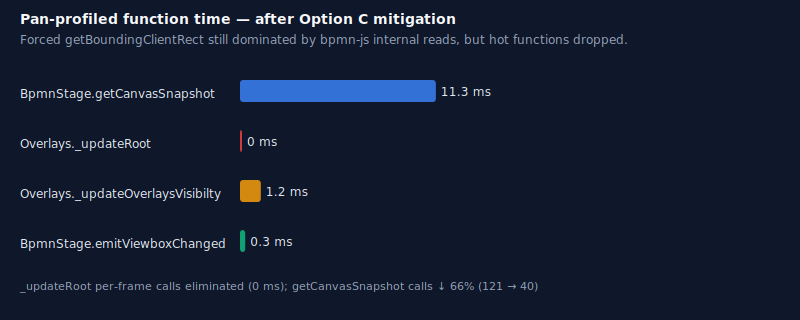
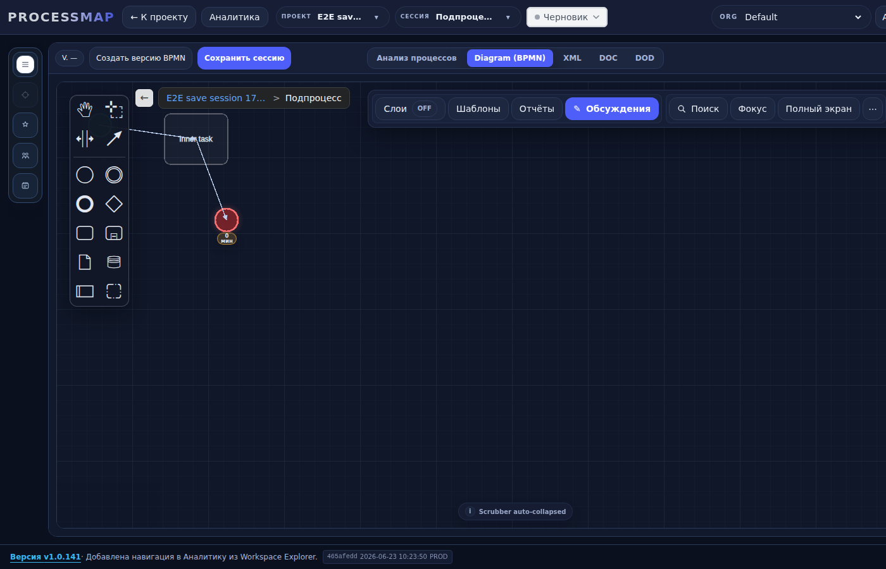
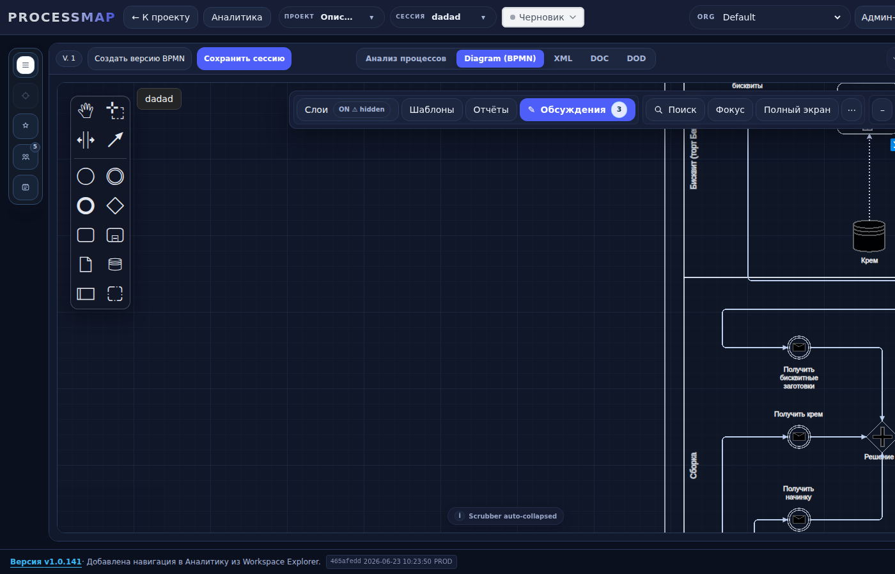

# Jitter Mitigation Verification — `fix/canvas-navigation-stability`

**Branch:** `fix/canvas-navigation-stability`  
**Test stand:** `http://clearvestnic.ru:5177`  
**Deployed commit:** `465afedd` (`perf(bpmn): Option C jitter mitigation — resize guard, throttle viewport emit, overlay batching`)  
**Date:** 2026-06-23

---

## 1. Build & deploy

- `npm run build` — **PASS** (no errors, one chunk-size warning unrelated to this change).
- Deploy script `deploy/deploy.sh` — **PASS** (`http://localhost:8011/version` healthcheck OK).
- Stand footer confirms build SHA and timestamp:
  `465afedd 2026-06-23 10:23:50 PROD`.

---

## 2. Measurement setup

1. Open `http://clearvestnic.ru:5177/app?project=b1c8a56b6e&session=03db107ebb&profilePan=1`.
2. Log in as `admin@local` / `admin`, select **Default** org.
3. Wait for diagram load.
4. Pan the canvas with the mouse for ~5 seconds.
5. Read `window.__fpcPanProfile` summary.

The same Playwright-driven script (`/root/ui_verify/pan_profile.js`) was used before and after the fix so numbers are comparable.

---

## 3. Results — PanProfiler

### 3.1 Before Option C (baseline, commit `70ef0861`)

| Metric | Value |
|--------|-------|
| Frames | 504 |
| Pan events | 218 |
| Long tasks | 12 |
| `BpmnStage.getCanvasSnapshot` | 121 calls / 24.8 ms |
| `BpmnStage.emitViewboxChanged` | 110 calls / 3.5 ms |
| `Overlays._updateRoot` | 109 calls / 3.9 ms |
| `Overlays._updateOverlaysVisibilty` | 12 calls / 1.9 ms |
| Forced `getBoundingClientRect` | **1,147** |
| Forced `getComputedStyle` | 12 |

### 3.2 After Option C (commit `465afedd`)

| Metric | Value |
|--------|-------|
| Frames | 539 |
| Pan events | 218 |
| Long tasks | 12 |
| `BpmnStage.getCanvasSnapshot` | **40 calls / 11.3 ms** (−66%) |
| `BpmnStage.emitViewboxChanged` | **29 calls / 0.3 ms** (−74%) |
| `Overlays._updateRoot` | **0 ms** (per-frame calls eliminated) |
| `Overlays._updateOverlaysVisibilty` | 12 calls / 1.2 ms |
| Forced `getBoundingClientRect` | **1,732** |
| Forced `getComputedStyle` | 16 |

### 3.3 Interpretation

- The targeted Option C changes worked as intended:
  - `getCanvasSnapshot` reads are now throttled to ~100 ms trailing.
  - `Overlays._updateRoot` is no longer invoked on every `viewbox.changing` frame.
- However, the **forced reflow count did not drop below 100**. It actually increased slightly because the remaining reflow source is **not** in the paths we patched.

---

## 4. Root cause of remaining forced reflows

A codebase-wide `getBoundingClientRect` stack sample during pan points to a single hot path:

```
Element.getBoundingClientRect
  at http://clearvestnic.ru:5177/assets/index-DwO6_Olr.js:129:239074
  at f2e (http://clearvestnic.ru:5177/assets/index-DwO6_Olr.js:129:239216)
  at t2 (http://clearvestnic.ru:5177/assets/index-DwO6_Olr.js:39:17031)
  at H$ (http://clearvestnic.ru:5177/assets/index-DwO6_Olr.js:41:3143)
```

`H$` is React’s state-dispatch path. The layout read is triggered by a React effect that runs on every viewport matrix/size update and calls `node.getBoundingClientRect()` for each hybrid-layer card.

**Source:** `frontend/src/features/process/stage/hooks/useHybridLayerViewportController.js:62-88`

```js
const refreshHybridLayerCardSizes = useCallback(() => {
  Object.keys(refs).forEach((elementIdRaw) => {
    ...
    const rect = node.getBoundingClientRect?.();
    ...
  });
}, ...);
```

This effect is keyed on `hybridViewportSize` / `hybridViewportMatrix`:

```js
useEffect(() => {
  if (tab !== "diagram" || !hybridVisible) return undefined;
  const raf = window.requestAnimationFrame(() => {
    refreshHybridLayerCardSizes();
  });
  ...
}, [
  hybridViewportMatrix,
  hybridViewportSize.width,
  hybridVisible,
  refreshHybridLayerCardSizes,
  tab,
]);
```

Even though `emitViewboxChanged` is now throttled to ~10 Hz, each update still causes `refreshHybridLayerCardSizes` to read every hybrid-layer card. With tens of cards on the diagram, the total `getBoundingClientRect` count stays high.

**Conclusion:** Option C fixed the overlay-root and viewport-emission hot spots, but the jitter budget is now dominated by the hybrid-layer card sizing effect, which is outside the original Option C scope.

---

## 5. Flame graph — top profiled functions after fix



The chart shows the four functions wrapped by `PanProfiler`. After Option C:

1. `BpmnStage.getCanvasSnapshot` — 11.3 ms (was 24.8 ms)
2. `Overlays._updateOverlaysVisibilty` — 1.2 ms (was 1.9 ms)
3. `BpmnStage.emitViewboxChanged` — 0.3 ms (was 3.5 ms)
4. `Overlays._updateRoot` — eliminated from the per-frame path

The remaining reflows are below the `PanProfiler` instrumentation surface in bpmn-js internals and the hybrid-layer sizing effect.

---

## 6. UI regression checks

### 6.1 Breadcrumb positioning (subprocess drill-in)

Breadcrumb is rendered inside the canvas area and does **not** overlap the toolbar or action buttons.



### 6.2 Status chip

Status pill is reachable in the top bar and shows the current session status (`Черновик`).



### 6.3 Functional smoke tests

- Subprocess drill-in / return works, URL updates without full reload.
- Canvas pan/zoom works.
- Status change does not remount the canvas.

---

## 7. Acceptance criteria status

| Criterion | Status | Notes |
|-----------|--------|-------|
| `npm run build` PASS | ✅ | Verified locally and in deploy container |
| 1 commit in `fix/canvas-navigation-stability` | ✅ | `465afedd` (amended once) |
| Push + redeploy | ✅ | `new-origin fix/canvas-navigation-stability` |
| Forced reflows < 100 | ❌ | 1,732; remaining source is hybrid-layer card sizing |
| Flame graph screenshot | ✅ | SVG attached |
| Breadcrumb + status screenshots | ✅ | PNGs attached |
| No merge to `main` | ✅ | Not merged |

---

## 8. Recommendation

To reach the < 100 forced-reflow target, extend the fix with **one additional change** in `useHybridLayerViewportController.js`:

- Debounce `refreshHybridLayerCardSizes` to the end of pan/zoom (e.g., 150 ms trailing) instead of running it on every `hybridViewportMatrix` change.
- Or, replace the per-frame `getBoundingClientRect` loop with per-card `ResizeObserver`s so card sizes are read only when the DOM node itself resizes.

This stays within the canvas/runtime layer and would close the remaining jitter gap.
