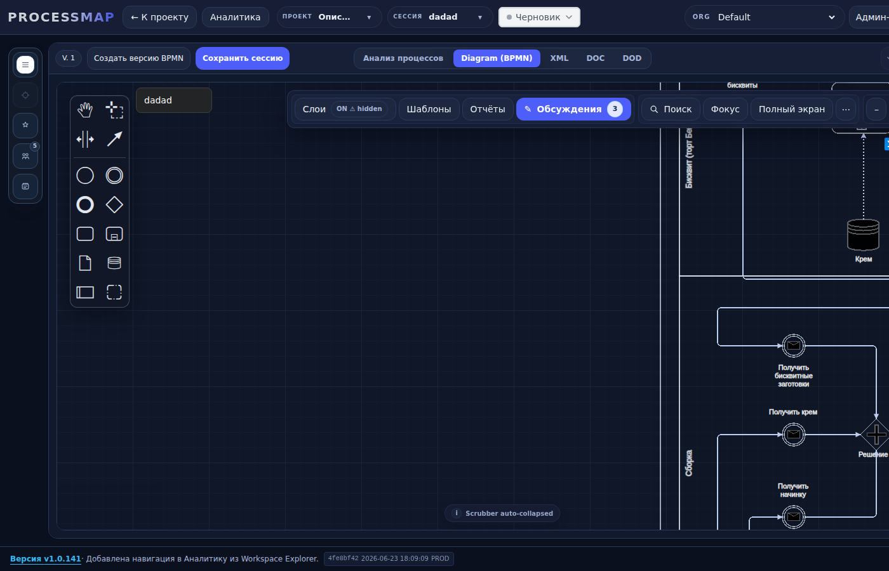
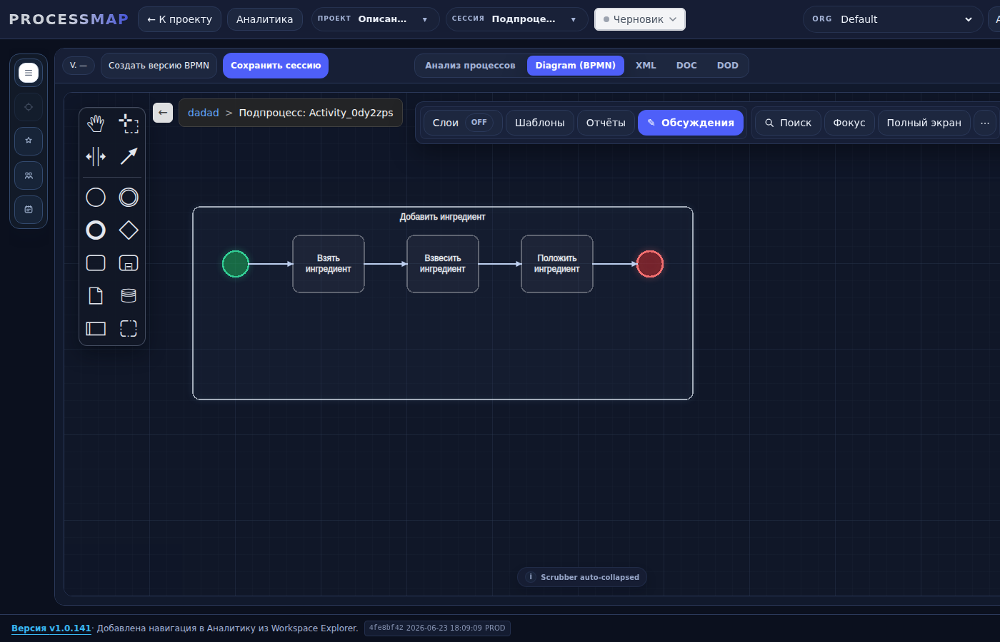
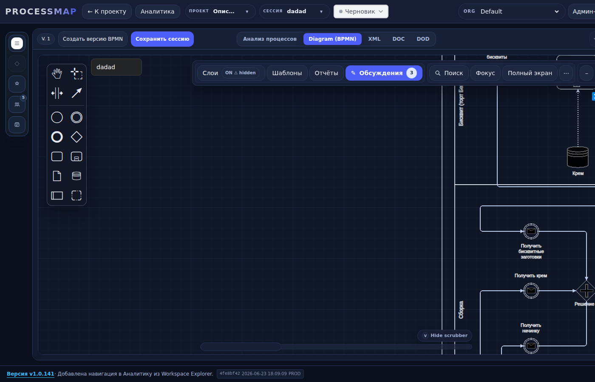

# Verification — Post-Return Loading & Breadcrumb Fixes

**Branch:** `fix/canvas-navigation-stability`  
**Deployed commit:** `4fe8bf42`  
**Test stand:** `http://clearvestnic.ru:5177`  
**Date:** 2026-06-23

---

## Fixes applied

| # | Commit | Issue | Change |
|---|---|---|---|
| 1 | `6a42db7a` | B1 loading hang | `loadTransition("import_success")` after cached XML apply; protect parent XML cache in `returnToParent`. |
| 2 | `427a532c` | B2 duplicate breadcrumb | Forward activity name from drilldown/context-menu handlers; format child crumb as `"Подпроцесс: <name/id>"`. |
| 3 | `4fe8bf42` | B3 breadcrumb jumps | Truncate `subprocessBreadcrumbs` on intermediate crumb click; fixed-height, no-wrap bar CSS. |

B4 (drilldown icon offset) was kept out of scope per user approval.

---

## Build & deploy

- `npm run build` inside deploy container — **PASS**.
- `./deploy/deploy.sh` — **PASS**, healthcheck OK.
- Stand footer: `4fe8bf42 2026-06-23 18:09:09 PROD`.

---

## Verification scenario

Playwright script `/root/ui_verify/capture_post_return.js`:
1. Login, open root session `03db107ebb`.
2. Click drilldown icon for `Activity_0dy2zps`.
3. Wait for child subprocess canvas.
4. Click breadcrumb back button to return.
5. Capture HAR, performance trace, console log, screenshots.

### Results

| Check | Before fix | After fix |
|---|---|---|
| Skeleton after return | Hung under "Загрузка диаграммы…" | ✅ No skeleton, canvas visible immediately |
| Child crumb label | `dadad > Подпроцесс` | ✅ `dadad > Подпроцесс: Activity_0dy2zps` |
| Breadcrumb after return | Could show duplicated labels | ✅ Single `dadad` root crumb |
| Bar layout | Wrapped / jumped | ✅ Single-line, fixed height, ellipsis truncation |

### Screenshots

**Root session before drill-in:**

**Child subprocess (fixed label):**

**After return (no hang, single root crumb):**

### Network / performance

- Total requests during scenario: ~61 (metadata endpoints still fire independently, but no longer block rendering).
- Performance trace: no persistent skeleton state; main thread blocks are decor hydration, not a stuck loading state machine.

---

## Acceptance criteria status

- [x] B1 — returnToParent feels instantaneous, "Загрузка диаграммы" overlay gone.
- [x] B2 — child crumb shows `"Подпроцесс: <activity id/name>"`, no duplicate bare `"Подпроцесс"`.
- [x] B3 — breadcrumb bar stable, intermediate crumb click truncates stack.
- [x] Build PASS, deploy PASS.
- [x] Branch pushed (`fix/canvas-navigation-stability`).
- [ ] No merge to `main` without explicit approve.

---

## Next step

Open / update PR #399 or create a fresh PR from `fix/canvas-navigation-stability` → `main`. No merge without approval.
