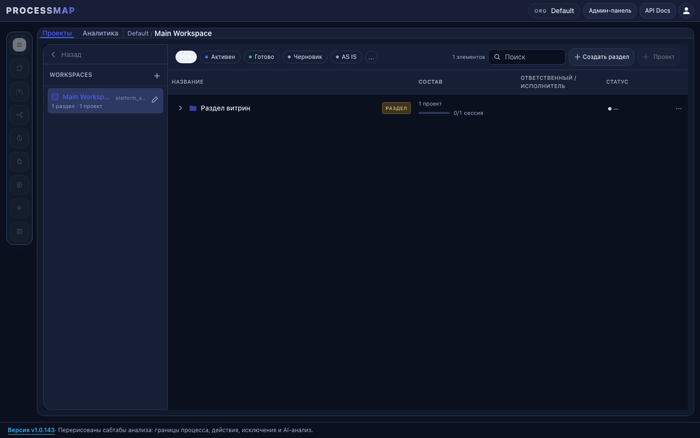
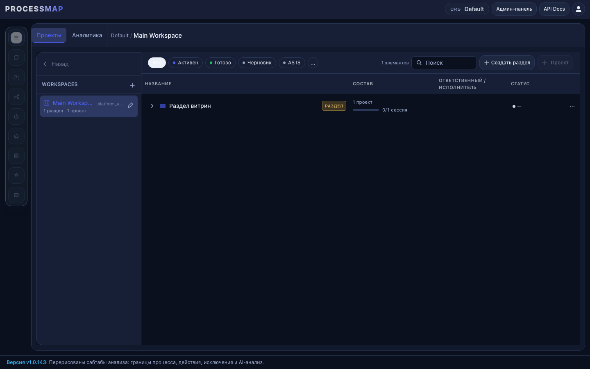
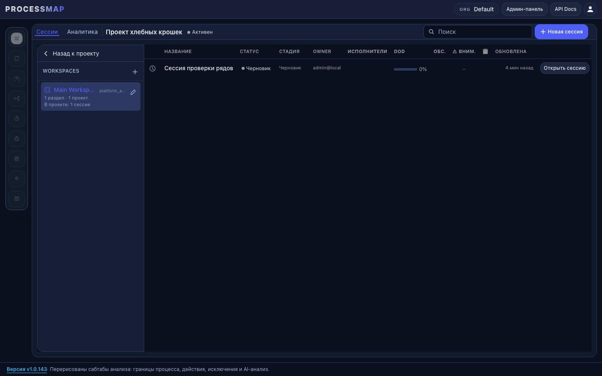
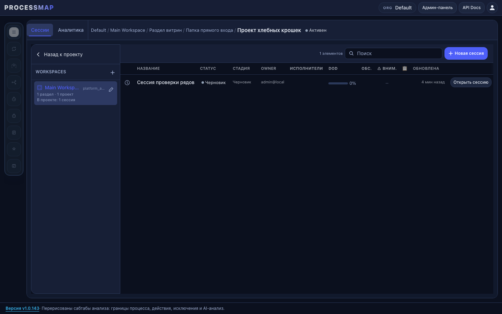

# fix/header-and-breadcrumbs — UI

## Контекст

- Ветка: `fix/header-and-breadcrumbs`.
- База: `origin/main` после merge `feature/workspace-toolbar-restructure`.
- Обязательные ui-ux-pro-max запросы выполнены через `search.py`:
  - `app header height`
  - `breadcrumb navigation`
  - `layout consistency`

Выводы для реализации:

- Глобальный explorer header должен иметь устойчивую высоту 52-56px и центрировать tabs внутри ряда.
- Навигационная иерархия 3+ уровней должна показывать текущее положение пользователя, а не историю кликов.
- Workspace и project экраны должны держать один паттерн рядов: global header / context toolbar / table header.

## Before / After

Снимки сделаны через локальный runtime: FastAPI на SQLite, Vite frontend, Playwright. Docker daemon на машине не был запущен, поэтому compose-верификация UI не выполнялась.

| Экран | До | После |
| --- | --- | --- |
| Workspace |  |  |
| Project |  |  |

## Проверенные UI-метрики

До фикса на project direct open:

- project header: 37px.
- project toolbar: отсутствует.
- search и `Новая сессия`: в global header.
- breadcrumbs: только `Проект хлебных крошек`.
- native dialogs: `[]`.

После фикса на project direct open:

- project header: 57px.
- project toolbar: 53px.
- search и `Новая сессия`: в `project-filter-toolbar`.
- breadcrumbs: `Default / Main Workspace / Раздел витрин / Папка прямого входа / Проект хлебных крошек`.
- native dialogs: `[]`.

## Pre-delivery checklist ui-ux-pro-max

- Header height: token `--explorer-header-h` поднят до `3.5rem`; portal header получает тот же token явно.
- Tabs: controls высотой `h-9`, выровнены по центру ряда, не выглядят сжатыми.
- Breadcrumbs: полный путь восстанавливается из backend данных при прямом входе.
- Layout consistency: project actions перенесены из global header в context toolbar, как на workspace.
- Focus/accessibility: существующие breadcrumbs сохраняют `aria-current="page"` и `focus-visible` ring.
- Responsive risk: длинный путь остается single-line с overflow контейнера; полный path доступен через `title`.
- Нативные dialogs: Playwright метрики показывают `dialogs: []`.
