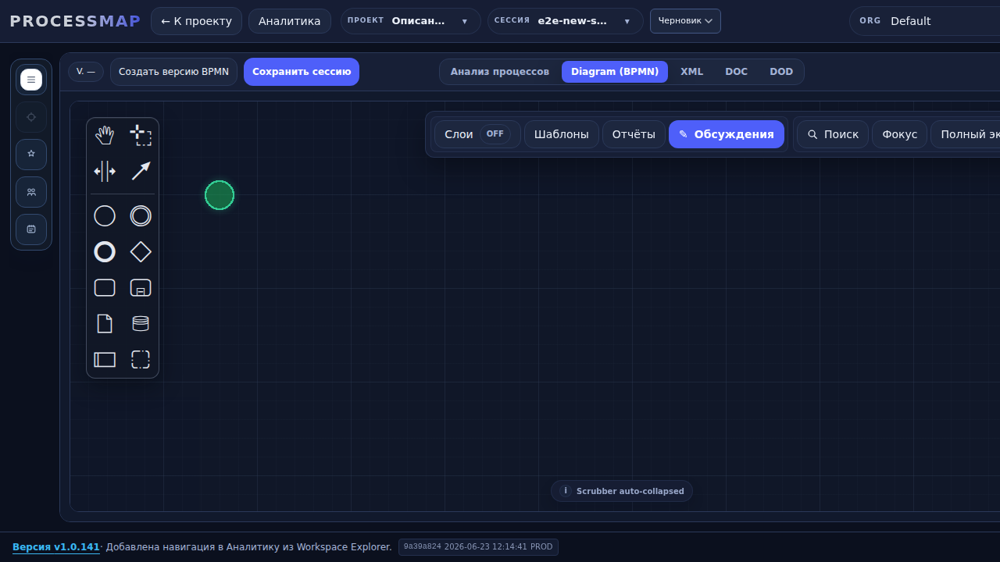
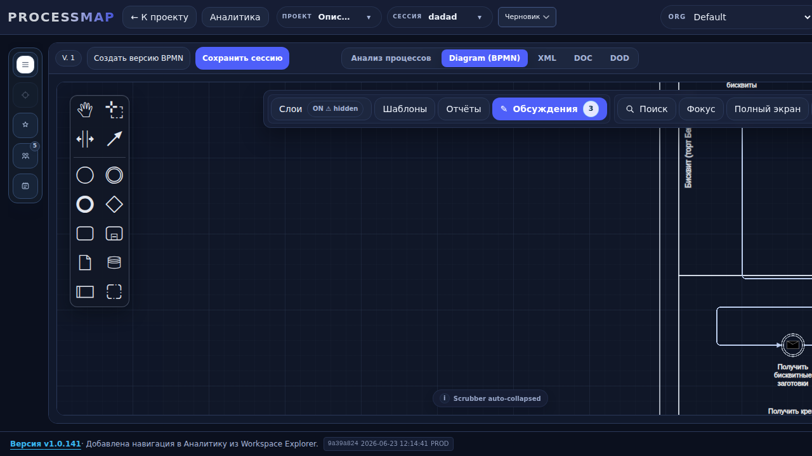

# Verification — New Session Canvas Timeout

**Branch:** `fix/new-session-canvas-timeout`  
**Base:** `new-origin/main`  
**Deployed commit:** `9a39a824`  
**Test stand:** `http://clearvestnic.ru:5177`  
**Date:** 2026-06-23

---

## Root cause

For a brand-new session the backend intentionally returns an empty `bpmn_xml` string (see `backend/app/_legacy_main.py:7256` — "Do not auto-generate a starter BPMN for brand-new empty sessions").

`BpmnStage.jsx` already handles this case: when `resolvedXml` is empty and `srcHint` is set, it calls `renderNewDiagramInModelerRuntime()` which uses `bpmn-js` `createDiagram()` to render a default empty diagram with a start event.

However, `renderNewDiagramInModelerRuntime` did **not** signal the diagram-load state machine (`useDiagramLoadStateMachine`). The machine stayed in `initializing`/`importing`, and after the cold timeout of **20 000 ms** it transitioned to `timeout`, causing the UI overlay:

> Ошибка загрузки диаграммы / exceeded 20000ms / Состояние: timeout

The actual canvas was already rendered underneath, but the state machine never reached `ready`.

---

## Fix

`frontend/src/features/process/bpmn/stage/orchestration/bpmnRenderRuntimeLifecycle.js`

- Added `loadTransition` to the context destructuring of `renderNewDiagramInModelerRuntime`.
- Call `loadTransition?.("import_start")` before `runtime.createDiagram()`.
- Call `loadTransition?.("import_success")` after the diagram is created, fitted and visible.

This mirrors the state-machine transitions already present in `renderModelerDiagram`.

---

## Build & deploy

- `npm run build` — **PASS** (one unrelated chunk-size warning).
- `./deploy/deploy.sh` — **PASS**, healthcheck `http://localhost:8011/version` returned 200.
- Stand footer shows: `9a39a824 2026-06-23 12:14:41 PROD`.

---

## Verification

Automated Playwright script: `/root/ui_verify/verify_new_session.js`

| Scenario | Result | Screenshot |
|---|---|---|
| Create new empty session | ✅ Canvas ready, start event visible, no timeout | `new_session_empty.png` |
| Open existing session with BPMN | ✅ Canvas ready, diagram visible, no timeout | `new_session_existing.png` |

### New empty session

### Existing BPMN session

---

## Acceptance criteria

- [x] New session opens instantly with an empty diagram (start event + empty process).
- [x] Existing/imported BPMN sessions still load correctly.
- [x] 20-second timeout no longer triggers on new sessions.
- [x] `npm run build` PASS.
- [x] Branch `fix/new-session-canvas-timeout` pushed to `new-origin/main` base.
- [ ] Create PR (branch is ready; no merge without explicit approve).

---

## Next step

Open a PR from `fix/new-session-canvas-timeout` → `main` (separate from PR #399). No merge or further deploy without explicit approval.
