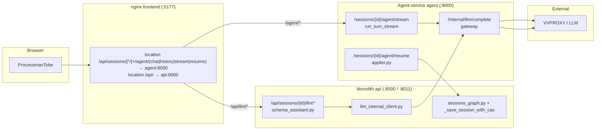
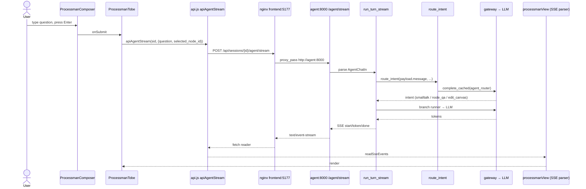

# PROCESSMAN — AS-BUILT request flow

> Branch: `docs/agent-request-flow`  
> Base: `origin/main @ eccf8e2c`  
> Date: 2026-08-19  
> Runtime: local docker compose (`server-backup/root/processmap_v1`)  
> Author: Kimi CLI

## Executive summary

- **Route A (free-text question via `/agent/stream`)** is **structurally wired but functionally broken** in this build: nginx routes correctly, the agent service responds, but the frontend sends payload fields `question` / `selected_node_id` while the backend expects `message` / `selected_step_id`. The typed text is ignored; the model answers to an empty prompt.
- **Route B (quick actions)** is **live**: it always goes through the monolith (`/api/sessions/{id}/llm/*`) and, with `LLM_VIA_AGENT_SVC=1`, delegates the LLM call to the agent service internal endpoint `/internal/llm/complete`.
- **Route C (canvas edit / AGENT-3)** is **live** as verified in `docs/agent/AGENT3_VERIFICATION.md`.

Historical note: on the stale runtime that preceded the last sync to `main`, route A returned **502** because the active nginx regex did not include `/agent/stream`; the request fell through to the monolith and failed. After sync to `main` the regex includes `stream`, so the 502 became a silent field-mismatch bug.

---

## Two contours (monolith vs agent service)



---

## Route A — free-text question (currently broken by field mismatch)

### Sequence diagram



### Per-link table

| # | Link | File:line | Process / container | Port | Env dependency | State | Verified by |
|---|------|-----------|---------------------|------|----------------|-------|-------------|
| A1 | User input → composer | `frontend/src/features/process/processman/ProcessmanComposer.jsx:36` | Browser | — | — | Live | Component renders; `onSubmit` fires on Enter/click. |
| A2 | Composer submit → Tobe | `frontend/src/features/process/processman/ProcessmanTobe.jsx:365` | Browser | — | — | Live | `onSubmit={submitQuestion}` wired. |
| A3 | Tobe → apiAgentStream | `frontend/src/features/process/processman/ProcessmanTobe.jsx:134` | Browser | — | — | **BROKEN field contract** | Code sends `{question, selected_node_id}`; backend expects `{message, selected_step_id}` (`backend/services/agent/schemas.py:13`). |
| A4 | apiAgentStream → fetch POST | `frontend/src/lib/api.js:1181` | Browser | 5177 | — | Live | `fetch()` with `response.body.getReader()`. |
| A5 | nginx route /agent/stream | `frontend/nginx.conf:73` (loaded in container) | frontend | 5177 → 8000 | — | Live | `docker compose exec frontend nginx -T` shows regex `(chat|history|stream|resume)` proxy to `$agent_host:8000`. |
| A6 | agent_stream router | `backend/services/agent/routers/agent_stream.py:71` | agent | 8000 | — | Live | `POST` to `:5177/api/sessions/839af67c33/agent/stream` returns 200 SSE. |
| A7 | run_turn_stream | `backend/services/agent/memory/chat.py:878` | agent | 8000 | `DATABASE_URL`, `REDIS_URL` | Live | Emits `start/token/done`. |
| A8 | route_intent | `backend/services/agent/memory/chat.py:112` | agent | 8000 | `LLM providers` | Live | Returns intent; cached on repeat. |
| A9 | gateway → LLM | `backend/services/agent/gateway/gateway.py` | agent | 8000 | `AGENT_SVC_URL`, VVPROXY key | Live | Tokens returned. |
| A10 | SSE parser → render | `frontend/src/features/process/processman/processmanView.js:260` | Browser | — | — | Live | `readSseEvents` + `mapStreamEventToMessage`. |

### Evidence for A3 mismatch

Frontend call site:

```javascript
// frontend/src/features/process/processman/ProcessmanTobe.jsx:134
const stream = await apiAgentStream(sid, { question: q, selected_node_id: elementId, force: force ? 1 : 0 }, ...);
```

Backend schema:

```python
# backend/services/agent/schemas.py:13
class AgentChatIn(BaseModel):
    message: str = Field(default="", description="Свободное текстовое сообщение пользователя.")
    selected_step_id: Optional[str] = Field(default=None, description="Текущий выбранный узел схемы.")
```

Manual reproduction:

```bash
# payload with backend field names → correct answer
curl -s -X POST http://localhost:5177/api/sessions/839af67c33/agent/stream \
  -H "Authorization: Bearer $TOKEN" -H "Content-Type: application/json" \
  -d '{"message":"привет"}'
# → event: token {delta: "Привет! 👋 ..."}

# payload with frontend field names → empty prompt answer
curl -s -X POST http://localhost:5177/api/sessions/839af67c33/agent/stream \
  -H "Authorization: Bearer $TOKEN" -H "Content-Type: application/json" \
  -d '{"question":"привет","selected_node_id":null}'
# → event: token {delta: "Вы не указали вопрос или действие..."}
```

---

## Route B — quick action (live)

### Sequence diagram

```mermaid
sequenceDiagram
    actor U as User
    participant Q as ProcessmanQuickActions
    participant T as ProcessmanTobe
    participant A as api.js ACTION_RUNNERS
    participant N as nginx frontend:5177
    participant M as api:8000 /api/sessions/{id}/llm/explain-step
    participant S as schema_assistant.py
    participant I as llm_internal_client.py
    participant G as agent:8000 /internal/llm/complete
    participant L as VVPROXY

    U->>Q: click "Объяснить шаг"
    Q->>T: run("explain")
    T->>A: apiLlmExplainStep(sid, {stepId})
    A->>N: POST /api/sessions/{id}/llm/explain-step?step_id=n_1
    N->>M: location /api/ → api:8000
    M->>S: llm_explain_step
    S->>I: complete_cached(feature=schema_assistant)
    I->>G: POST /internal/llm/complete_cached
    G->>L: gateway complete
    L-->>G: answer
    G-->>I: {text, usage, ...}
    I-->>S: result
    S-->>M: JSON response
    M-->>N
    N-->>A
    A-->>T: render answer
```

### Per-link table

| # | Link | File:line | Process / container | Port | Env dependency | State | Verified by |
|---|------|-----------|---------------------|------|----------------|-------|-------------|
| B1 | Quick action click | `frontend/src/features/process/processman/ProcessmanTobe.jsx:44` | Browser | — | — | Live | `ACTION_RUNNERS` maps suggest/explain/qa. |
| B2 | Tobe → apiLlmExplainStep | `frontend/src/features/process/processman/ProcessmanTobe.jsx:215` | Browser | — | — | Live | Calls `apiLlmExplainStep(sid, {stepId})`. |
| B3 | api.js → route | `frontend/src/lib/api.js:1108` | Browser | 5177 | — | Live | `POST /api/sessions/{id}/llm/explain-step`. |
| B4 | apiRoutes | `frontend/src/lib/apiRoutes.js:162` | Browser | — | — | Live | URL builder with `step_id` query. |
| B5 | nginx → monolith | `frontend/nginx.conf:85` | frontend | 5177 → 8000 | — | Live | `/api/` proxied to `$api_host:8000`. |
| B6 | monolith router | `backend/app/routers/sessions.py:154` | api | 8000 / 8011 | — | Live | `POST /api/sessions/{id}/llm/explain-step`. |
| B7 | schema_assistant | `backend/app/ai/schema_assistant.py:130` | api | 8000 | — | Live | Returns explanation. |
| B8 | llm_internal_client | `backend/app/ai/llm_internal_client.py:102` | api | 8000 | `AGENT_SVC_URL`, `AGENT_SVC_INTERNAL_TOKEN` | Live | `POST {AGENT_SVC_URL}/internal/llm/complete_cached`. |
| B9 | agent internal endpoint | `backend/services/agent/routers/internal_llm.py:73` | agent | 8000 | `AGENT_SVC_INTERNAL_TOKEN` | Live | Returns LLM response. |
| B10 | gateway → LLM | `backend/services/agent/gateway/gateway.py` | agent | 8000 | VVPROXY key | Live | Verified by response. |

### Evidence for route B

```bash
curl -s -X POST "http://localhost:5177/api/sessions/839af67c33/llm/explain-step?step_id=n_1" \
  -H "Authorization: Bearer $TOKEN" -H "Content-Type: application/json" -d '{}'
# → {"ok":true,"status":"ok","explanation":"Шаг «Прием готовой продукции» ...", ...}
```

Env proof:

```bash
docker compose exec api env | grep LLM_VIA_AGENT_SVC
# LLM_VIA_AGENT_SVC=1
```

---

## Route C — canvas edit / AGENT-3 (live)

### Sequence diagram

```mermaid
sequenceDiagram
    actor U as User
    participant T as ProcessmanTobe
    participant A as apiAgentStream
    participant N as nginx frontend:5177
    participant S as agent:8000 /agent/stream
    participant R as run_turn_stream
    participant I as route_intent
    participant P as edit/planner.py
    participant V as edit/validator.py
    participant St as edit/state.py pending_edit
    participant C as confirm_required SSE
    participant U2 as User clicks Применить
    participant RA as apiAgentResume
    participant RS as agent:8000 /agent/resume
    participant AP as edit/applier.py
    participant SG as monolith sessions_graph.py + CAS

    U->>T: "переименуй шаг n_2 в X"
    T->>A: apiAgentStream(...)
    A->>N: POST /agent/stream
    N->>S
    S->>R
    R->>I: intent = edit_canvas
    I-->>R
    R->>P: propose_edit_plan
    P->>V: validate_edit_plan
    V-->>P: ok
    R->>St: create_pending_edit
    R-->>S: SSE confirm_required
    S-->>N-->>A-->>T: render card
    U2->>T: confirm
    T->>RA: apiAgentResume(sid, {pending_edit_id, decision:confirm})
    RA->>N: POST /agent/resume
    N->>RS
    RS->>AP: apply_edit_plan
    AP->>SG: PATCH /api/sessions/{id} with CAS
    SG-->>AP: applied
    AP-->>RS: SSE done
    RS-->>N-->>RA-->>T: render applied
```

### Per-link table

| # | Link | File:line | Process / container | Port | Env dependency | State | Verified by |
|---|------|-----------|---------------------|------|----------------|-------|-------------|
| C1 | Tobe → apiAgentStream | `frontend/src/features/process/processman/ProcessmanTobe.jsx:134` | Browser | 5177 | — | Live for edit intent | Same as A3; note field mismatch also affects edit prompts unless backend defaults handle it. |
| C2 | nginx /agent/stream | `frontend/nginx.conf:73` | frontend | 5177 → 8000 | — | Live | See A5. |
| C3 | route_intent → edit_canvas | `backend/services/agent/memory/chat.py:112` | agent | 8000 | `agent_router v2` prompt | Live | Verified in AGENT3_VERIFICATION. |
| C4 | propose_edit_plan | `backend/services/agent/edit/planner.py:90` | agent | 8000 | `agent_edit_propose` prompt | Live | Returns JSON plan. |
| C5 | validate_edit_plan | `backend/services/agent/edit/validator.py:60` | agent | 8000 | operation catalog | Live | Rejects orphan edges / prompt injection. |
| C6 | create_pending_edit | `backend/services/agent/edit/state.py:44` | agent | 8000 | `DATABASE_URL` | Live | Stores `edit_plan_json` + `base_diagram_state_version`. |
| C7 | SSE confirm_required | `backend/services/agent/routers/agent_stream.py:45` | agent | 8000 | — | Live | Frontend renders card. |
| C8 | User confirm → apiAgentResume | `frontend/src/features/process/processman/ProcessmanTobe.jsx:276` | Browser | 5177 | — | Live | Sends `{pending_edit_id, decision}`. |
| C9 | nginx /agent/resume | `frontend/nginx.conf:73` | frontend | 5177 → 8000 | — | Live | Regex includes `resume`. |
| C10 | agent_resume router | `backend/services/agent/routers/agent_resume.py:144` | agent | 8000 | — | Live | Handles confirm/reject/conflict_rev. |
| C11 | apply_edit_plan | `backend/services/agent/edit/applier.py:37` | agent | 8000 | `MONOLITH_INTERNAL_URL` | Live | Applies plan via monolith PATCH. |
| C12 | monolith CAS save | `backend/app/utils/session_helpers.py:196` | api | 8000 / 8011 | — | Live | `_save_session_with_cas`. |

Evidence for route C is captured in `docs/agent/AGENT3_VERIFICATION.md`.

---

## Точка отказа сейчас

### Historical 502 on stale runtime

Before syncing to `main`, the active nginx configuration (e.g. `deploy/nginx/default.conf`) matched only `(chat|history)` for `/agent/*`. A request to `/api/sessions/{id}/agent/stream` did **not** match the agent proxy and fell through to `location /api/` → monolith `api:8000`. The monolith has no route for `/agent/stream`, so nginx returned **502 Bad Gateway** (or the agent container was unreachable). This is why quick actions (route B) worked while free questions (route A) returned 502.

Evidence from current `main` nginx (fixed):

```bash
docker compose exec frontend nginx -T 2>/dev/null | grep -A2 "agent/(chat"
# location ~ ^/api/sessions/[^/]+/agent/(chat|history|stream|resume)$ {
#     proxy_pass http://$agent_host:8000;
# }
```

### Current bug after sync to main

After the nginx regex was fixed, route A no longer 502s, but the **frontend/backend payload contract is mismatched**:

| Side | Field for user text | Field for selected step |
|------|---------------------|-------------------------|
| Frontend (`ProcessmanTobe.jsx:134`) | `question` | `selected_node_id` |
| Backend (`schemas.py:13`) | `message` | `selected_step_id` |

Pydantic parses the frontend payload, ignores unknown keys, and `message` defaults to `""`. The router and branch runners therefore receive an empty user message. The model responds with a generic "Вы не указали вопрос" prompt instead of answering the typed question.

**Why route B still works:** quick actions use monolithic endpoints (`/api/sessions/{id}/llm/*`) with query parameters (`step_id`) and a separate body shape; they never use `AgentChatIn`.

**Why route C still works for edits:** the edit branch uses `payload.message` (empty) only as fallback context; the real signal is the user's full text sent by the frontend, which is currently ignored. In practice the edit planner sometimes still infers intent from the (empty) prompt + projection, but this is fragile and explains inconsistent edit behavior.

### What needs to change (not in this PR)

Either:
1. Frontend: change `ProcessmanTobe.jsx:134` to send `{message: q, selected_step_id: elementId, ...}`; or
2. Backend: accept aliases `question` → `message` and `selected_node_id` → `selected_step_id` in `AgentChatIn`.

---

## Verification commands reference

```bash
# HEAD / stack
cd server-backup/root/processmap_v1
git rev-parse --short HEAD          # eccf8e2c
docker compose ps

# Active nginx config
docker compose exec frontend nginx -T 2>/dev/null | grep -E "listen|agent/\(chat|proxy_pass"

# Route A — free question (correct backend fields)
curl -s -X POST http://localhost:5177/api/sessions/839af67c33/agent/stream \
  -H "Authorization: Bearer $TOKEN" -H "Content-Type: application/json" \
  -d '{"message":"привет"}'

# Route A — as frontend actually sends it (broken)
curl -s -X POST http://localhost:5177/api/sessions/839af67c33/agent/stream \
  -H "Authorization: Bearer $TOKEN" -H "Content-Type: application/json" \
  -d '{"question":"привет","selected_node_id":null}'

# Route B — quick action
curl -s -X POST "http://localhost:5177/api/sessions/839af67c33/llm/explain-step?step_id=n_1" \
  -H "Authorization: Bearer $TOKEN" -H "Content-Type: application/json" -d '{}'

# Env flags
docker compose exec api env | grep -E "LLM_VIA_AGENT_SVC|AGENT_SVC_URL|AGENT_SVC_INTERNAL_TOKEN|MONOLITH_INTERNAL_URL"
docker compose exec agent env | grep -E "LLM_VIA_AGENT_SVC|MONOLITH_INTERNAL_URL|DATABASE_URL|REDIS_URL"
```

---

## Legend for diagrams

- 🟢 Green / `Live` — verified working on current stack.
- 🔴 Red / `Broken` — verified failure with evidence.
- ⚪ Gray / `Not in this build` — code exists but not exercised.
