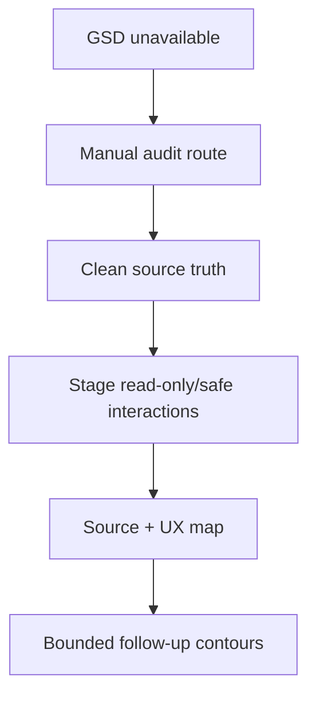

# Аудит навигации Analysis surface и UX действий с продуктом

Дата аудита: 2026-05-06

Контур: `audit/analysis-surface-navigation-and-product-actions-ux-map-v1`

Ограничения: audit-only; product code, frontend, backend, schema, BPMN XML truth и save/CAS не менялись.

## 1. GSD / source / runtime truth

| Поле | Значение |
| ---- | -------- |
| GSD CLI | `GSD_UNAVAILABLE`: `gsd` CLI не найден |
| gsd-sdk | `/Users/mac/.nvm/versions/node/v22.19.0/bin/gsd-sdk`, `v0.1.0` |
| gsd-sdk route query | unsupported commands for requested route |
| `.planning` | отсутствует |
| GSD route | `GSD_FALLBACK_MANUAL_AUDIT_ONLY` |
| repo | `/private/tmp/processmap_audit_analysis_surface_navigation_and_product_actions_ux_map_v1` |
| branch | `audit/analysis-surface-navigation-and-product-actions-ux-map-v1` |
| HEAD | `a97b053fcdeaf502b9e99ba26760392e7129386a` |
| origin/main | `a97b053fcdeaf502b9e99ba26760392e7129386a` |
| merge-base | `a97b053fcdeaf502b9e99ba26760392e7129386a` |
| git status на старте | `## audit/analysis-surface-navigation-and-product-actions-ux-map-v1...origin/main` |
| app version source | `v1.0.103`, `frontend/src/config/appVersion.js` |
| required commits | `cbe25e0` draft reset fix, `a97b053` visibility/labels fix, `e9a4268` product actions feature |
| stage | `https://stage.processmap.ru` |
| served bundle | `/assets/index-DtvUpSZv.js` |
| bundle markers | `v1.0.103`, `a97b053`, `Действия с продуктом`, `Анализ процессов`, `Diagram (BPMN)`, `DOC`, `DOD`, `product_actions` |
| safe session | project `985db290f5`, session `d03e007cf3`, title `RUNTIME_PRODUCT_ACTION_PROOF_20260505202319` |
| safe session version | `diagram_state_version=13` at audit read |
| BPMN XML baseline | len `790`, sha256 `43c2f45f7dad0a97be3f3dfcf415d48ceafe3c0fb3e2dd2bd30c438e31a5d66e` |
| product actions rows | `2`: one old empty v1 artifact, one v2 marker row |
| runtime mutations | no product/data saves in this audit |



## 2. Executive summary

> [!summary]
> Stage `v1.0.103` now proves product-actions storage works, but the surrounding UX still teaches the wrong mental model. Default tab behavior and Explorer/session opening are separate roots; product-actions editing is technically correct but visually too form-first; Analysis surface still mixes primary work, routes/scenarios, diagnostics, reports and product-action entry in one vertical stack.

Коротко:

- Direct URL `/app?project=...&session=...` for the safe session opened `Diagram (BPMN)`.
- Opening the same session from project/session list after the active tab was `Анализ процессов` reopened `Анализ процессов`; source confirms session tab memory/current tab wins before the default.
- The URL model stores `project` and `session`, but not tab. There is no durable URL tab contract to distinguish "new session entry should start with diagram" from "restore current tab".
- The observed "opens on second click" was not reproduced as a failed session open in safe test. A likely UX root was reproduced: workspace root lists projects; clicking a project with the same name as its only session opens the project, not the session. The user then needs another click on the session row.
- `Действия с продуктом` are bound by selected timeline step. Rows store `step_id`, `node_id`, `bpmn_element_id`, `step_label`; listing filters by step id or node/BPMN id.
- Saved actions are currently shown as small chips (`product_name` / `action_type` / fallback `Действие`) above an always-open form. This is technically visible but weak as a "saved actions" surface.
- The Analysis surface feels chaotic because primary data entry, product actions, timeline filters, BPMN branch diagnostics, summary, exceptions, routes/scenarios, AI/report elements and technical badges coexist without a strong hierarchy.

Recommended first fixes should be split:

1. `fix/session-open-default-diagram-tab-v1`
2. `fix/explorer-session-open-double-click-v1`
3. `uiux/product-actions-panel-list-and-editor-v1`
4. `uiux/analysis-surface-information-hierarchy-v1`
5. `uiux/analysis-surface-discussion-style-polish-v1`

## 3. Default session tab audit

| Question | Evidence | Source file | Verdict |
| -------- | -------- | ----------- | ------- |
| Does direct session URL always open Analysis? | Safe direct URL opened `Diagram (BPMN)` | `useProcessTabs.defaultTabForSession()` returns `diagram` | no |
| Why can Explorer open into Analysis? | Runtime: after switching safe session to `Анализ процессов`, returning to project list and opening the same session opened `Анализ процессов` | `useProcessTabs.js:306-331` | session memory/current tab wins |
| Is tab in URL? | URL remained `/app?project=985db290f5&session=d03e007cf3`, no tab param | `processMapRouteModel.js:94-139` | no tab route contract |
| Does source default prefer Diagram? | `defaultTabForSession()` returns `diagram` for XML and empty XML | `useProcessTabs.js:45-50` | yes |
| Does session change use default first? | `nextTab = rememberedTab || intentTab || currentTab || defaultTabForSession(draft)` | `useProcessTabs.js:320-323` | no |
| Can callers force tab? | `openWorkspaceSession` supports `options.openTab` and `processTabIntent` | `App.jsx:1153-1183` | yes, but not used by normal session list |

Runtime scenario:

| Step | Actual |
| ---- | ------ |
| Direct open safe session URL | selected tab `Diagram (BPMN)` |
| Switch to `Анализ процессов` | product actions visible |
| Back to project list | route `/app?project=985db290f5` |
| Click session open link | route `/app?project=985db290f5&session=d03e007cf3`, selected tab `Анализ процессов` |

Preferred UX decision:

> [!important]
> Opening/entering a session from Explorer/project list should open `Diagram (BPMN)` by default. User-initiated tab switch can be remembered only within an already active session, or through an explicit URL tab parameter. Direct URL with an explicit future `tab` param should be respected.

Minimal implementation contour:

| Contour | Goal | Validation |
| ------- | ---- | ---------- |
| `fix/session-open-default-diagram-tab-v1` | Normal Explorer session entry passes `openTab: "diagram"` or changes session-change precedence so new entry starts with diagram | Runtime: from workspace/project list open session once -> `Diagram (BPMN)` |

Do not mix this with product-actions layout or double-click fixes.

## 4. Double-click session open audit

| Step | Expected | Actual | Evidence | Source suspect |
| ---- | -------- | ------ | -------- | -------------- |
| Workspace root shows safe artifact | User may read row as session because project and session share name | Row is project-level: type `Проект`, `1 сессий`, last activity `Сессия ...` | stage root body text | `WorkspaceExplorer.ProjectRow` |
| Click project title in workspace root | Opens project page | URL becomes/stays `/app?project=985db290f5`; session not opened | project row link href has only `project` | `WorkspaceExplorer.jsx:1328-1351`, `2001-2008` |
| Project page shows sessions | User must click session row/title/open | This is the second visible click | stage project page | `ProjectPane` / `SessionRow` |
| Click session row/open | Opens session | Runtime single click opened session; no failure reproduced | `GET /api/sessions/d03e007cf3` 200 | `WorkspaceExplorer.jsx:2147-2210`, `2451-2471` |

Source notes:

- Workspace root `ProjectRow` is a project navigation row. Its link is built from `projectId` only and calls `onNavigateToProject(project.id...)`.
- Project session rows are different UI: `SessionRow` builds a session URL with both `projectId` and `sessionId`, and calls `onOpen(session)`.
- `ProjectPane.handleOpenSessionRequest()` blocks duplicate opens while `openingSessionIdRef.current` is set. That is reasonable, but it can make rapid repeated clicks feel ignored while first open is in flight.

Verdict:

> [!warning]
> A true failed first session click was `NOT_REPRODUCED_IN_CURRENT_STAGE` on the safe session. The reproduced issue is a UX ambiguity: project row and its last session share the same visible name, so the first click opens project context, then the second click opens the session.

Recommended split:

| Contour | Goal | Why | Validation |
| ------- | ---- | --- | ---------- |
| `fix/explorer-session-open-double-click-v1` | Make workspace root project/session affordances explicit, and/or provide direct "Открыть последнюю сессию" for single-session projects | Reduces perceived double-click without changing session activation internals blindly | Runtime: user can tell project-open vs session-open; session row single click opens once |
| optional `runtime/explorer-session-open-forensics-v1` | If user still sees first-click no-op on actual data, collect console/network/route evidence | Current safe session did not reproduce an activation failure | Record route, activation phase, `/api/sessions/{sid}` |

## 5. Product actions UX audit

| Area | Current | Problem | Recommended fix |
| ---- | ------- | ------- | --------------- |
| Step context | Select `Шаг процесса`; badges show `Шаг: iv_start_StartEvent_1`, `Диаграмма: StartEvent_1`, row count | Technical ids dominate; relation to table row/BPMN element is not visual enough | Use compact context card: step label, role, BPMN id as secondary metadata, "linked to Diagram element" hint |
| Binding model | `deriveProductActionBindingFromStep()` reads step `id`, node id aliases, label and role | Correct but invisible as a model | Show selected step label and BPMN element link in a stable header |
| Saved actions list | Chips: `Действие`, marker name; active chip changes form | Chips look like filters/tags, not saved rows; old empty row becomes ambiguous `Действие` | Replace with list/cards/table rows: product, type/stage, object, method, role, binding |
| Add/edit form | Always open with 8 fields | Form dominates the block; user sees fields before understanding saved state | Collapse editor behind `Добавить действие`; edit opens inline/details panel |
| Empty state | `Для выбранного шага ещё нет действий с продуктом.` | Good start but too quiet | Put empty state in saved-list area and keep CTA nearby |
| Row count | `Строк: 2` total rows | Total count is not actionable and can confuse with current step count | Show `2 действия всего`, `2 для выбранного шага` or only current step count |
| Existing saved row | Selecting chip repopulates fields | Discoverability low | Row should have explicit `Редактировать`; selected/edit state should be visible |
| After save | Keeps saved row selected and fields filled | Correct | Keep, but move into edit row state |
| Status/error | Inline status after buttons | Correct but easy to miss | Use compact status line under editor footer |
| Storage | `interview.analysis.product_actions[]` | Correct | Keep; no generic autosave |

Binding source map:

| Field | Source / derivation |
| ----- | ------------------- |
| `step_id` | `step.id || step.step_id || step.stepId` |
| `node_id` | `step.node_id || step.nodeId || step.node_bind_id || step.bpmn_ref` |
| `bpmn_element_id` | same as `node_id` in MVP |
| `step_label` | `step.action || step.label || step.title || step.node_bind_title` |
| `role` | `step.role` |
| list by step | row matches selected `step_id`, or row `node_id`/`bpmn_element_id` matches selected node |

Runtime safe session rows:

| Row | Product | Step | BPMN |
| --- | ------- | ---- | ---- |
| `pa_mot2vsxc_0vp38g` | empty old v1 artifact | `iv_start_StartEvent_1` | `StartEvent_1` |
| `pa_motuh15e_hrd08m` | `RUNTIME_PRODUCT_ACTION_V2_20260506121630` | `iv_start_StartEvent_1` | `StartEvent_1` |

## 6. Analysis surface hierarchy audit

| Block | Keep primary? | Move to secondary? | Collapse? | Style recommendation |
| ----- | ------------- | ------------------ | --------- | -------------------- |
| A. Границы процесса | yes | no | optional after filled | Calm summary + edit affordance |
| B. Таблица шагов / действия процесса | yes | no | no | Primary work area; table first |
| Product actions | yes, near B | no | form collapsed, saved list visible | Saved rows as compact cards/table; editor as disclosure |
| Timeline filters / P0/P1/P2 | partial | yes for advanced filters | yes | Keep search/basic filters primary; P tiers in advanced unless user is in routes mode |
| Маршруты / Сценарии | no | yes | yes | Separate scenario analysis section below primary input |
| B2. Ветки BPMN | no | yes | yes by default | Diagnostic/branch view, not primary product-action workflow |
| C. Итоги и время | yes as summary | no | no, compact | Summary cards, not long diagnostics |
| D. Исключения | partial | yes | yes unless has content | Show count + expand |
| AI reports / AI questions | no as primary | yes | yes | Output/enrichment lane |
| Diagnostics / debug / fallback labels | no | yes | yes | hide under `Дополнительно` |

Why it feels chaotic:

- The primary sequence is not visually enforced. A/B/product-actions/C/D all look like similar panels.
- Product-actions form appears before a strong saved-actions summary, so the user sees input burden instead of accumulated value.
- Technical ids (`iv_start_StartEvent_1`, `StartEvent_1`) are visible at the same weight as business labels.
- Table, product-actions, routes/scenarios, B2 branch logic and summary all compete vertically.
- Some route/filter controls use technical P0/P1/P2 labels in primary layer even when the user is just editing product actions.

## 7. Discussion-style visual reference

> [!summary]
> The discussion/notification surfaces have the right visual language for product-actions list/editor: compact cards, calm borders, strong title/snippet/meta hierarchy, and small secondary actions.

Borrow:

| Pattern | Source | How to apply |
| ------- | ------ | ------------ |
| Compact row/card shell | `DiscussionNotificationCenterPanel.jsx:174-226` | Product action rows with product/type as title, method/object as snippet, step/BPMN as muted meta |
| Calm state colors | `rowShellClass()` in `DiscussionNotificationCenterPanel.jsx:61-69` | Use subtle info/success borders, not heavy form blocks |
| Small action buttons | `DiscussionNotificationCenterPanel.jsx:226-256` | `Редактировать`, `Удалить`, `К диаграмме` as quiet actions |
| Metadata hierarchy | `NotesMvpPanel.jsx:125-159`, `229-254` | Context first, ids second, business text prominent |
| Empty states | `DiscussionNotificationCenterPanel.jsx:42-59` | "Для выбранного шага ещё нет действий" with direct CTA |
| Filter grouping | `DiscussionNotificationCenterPanel.jsx:137-160` | Later product-action filters can be segmented, not chip soup |

Do not copy:

- notification read/unread semantics;
- attention state;
- discussion backend or thread model;
- mention/read/ack logic.

## 8. P0/P1/P2 reload audit

| Check | Result |
| ----- | ------ |
| Safe session P0/P1/P2 control visible in current Analysis surface | no; `data-testid="interview-tier-filter-p0"` absent because filters/paths context not opened |
| Reload reproduced | no |
| Network after attempted P0 click | none |
| Verdict | `NOT_REPRODUCED_IN_CURRENT_STAGE` |

Source suspects if it reappears:

| Source | Why |
| ------ | --- |
| `TimelineControls.jsx:589-604` | P0/P1/P2 filter chips call `patchTimelineFilter("tiers", ...)`; should be local/UI prefs only |
| `InterviewPathsView.jsx` tier tabs | scenario tier selection may update local path state |
| `usePlaybackController` / `pathHighlightTier` flows | path/playback selection can request diagram focus or scenario state |

Recommended follow-up only if reproduced:

| Contour | Goal |
| ------- | ---- |
| `runtime/path-classification-p0-p1-p2-reload-forensics-v1` | Capture exact control, route, console, network and state transition before code |

## 9. Recommended decomposition

| Priority | Contour | Goal | Why | Validation |
| -------- | ------- | ---- | --- | ---------- |
| P0 | `fix/session-open-default-diagram-tab-v1` | Explorer/session entry opens `Diagram (BPMN)` by default | Current tab memory can reopen `Анализ процессов`, conflicting with user expectation | From project/session list, single open -> selected tab `Diagram (BPMN)`; direct URL with future tab param respected if implemented |
| P0 | `fix/explorer-session-open-double-click-v1` | Remove project/session ambiguity and verify single-click session open | Workspace root project rows can look like sessions when project/session names match | Root project row clearly says project; session row clearly says session; no perceived no-op |
| P1 | `uiux/product-actions-panel-list-and-editor-v1` | Make saved product actions the primary view; collapse add/edit form | Current chips + always-open form hide saved state and binding | Saved row visible as card/table; add/edit explicit; values persist/save path unchanged |
| P1 | `uiux/analysis-surface-information-hierarchy-v1` | Reorder Analysis into primary workflow, secondary scenario/report/diagnostic areas | Current vertical stack mixes intake, product actions, routes, B2, summary, exceptions | Runtime screenshot: A/B/product-actions/C summary clear; B2/routes/AI under secondary |
| P2 | `uiux/analysis-surface-discussion-style-polish-v1` | Apply calm card/list visual language from discussions/notification center | Product-actions and Analysis blocks need hierarchy polish after layout decisions | Visual audit screenshots desktop/mobile |
| Conditional | `runtime/path-classification-p0-p1-p2-reload-forensics-v1` | Investigate P0/P1/P2 reload only with reproducible evidence | Not reproduced in safe session | Exact route/network/console proof |

## 10. Plan-gate

| Question | Answer |
| -------- | ------ |
| First fix to do | `fix/session-open-default-diagram-tab-v1` |
| Must not be mixed | Do not combine default tab, double-click Explorer UX, product-actions list/editor, Analysis hierarchy, P0/P1/P2 reload |
| Same root for default tab and double-click? | No. Default tab is `useProcessTabs` tab precedence. Double-click is Explorer project/session affordance or an unreproduced activation issue |
| Product-actions UX needs new component/layout? | Yes, likely keep persistence/model but redesign panel composition into saved list + collapsed editor |
| Discussion-style polish separate? | Yes. Polish after product-actions list/editor and hierarchy contours, not before |

Recommended first implementation prompt:

```text
fix/session-open-default-diagram-tab-v1

Goal:
When a user opens a session from Explorer/project session list, selected top-level tab should be Diagram (BPMN), not the previously active Analysis tab.

Scope:
- frontend tab/navigation only;
- no backend/schema/BPMN XML/save path changes;
- do not change product actions UI;
- do not change Explorer double-click behavior in this contour.

Source suspects:
- useProcessTabs.js session-change precedence;
- App.jsx/openWorkspaceSession openTab intent;
- WorkspaceExplorer ProjectPane session open path.

Acceptance:
- direct session entry from Explorer opens Diagram (BPMN);
- explicit internal intents still work;
- switching tabs inside an already open session still works;
- URL route remains stable.
```

## 11. Final verdict

`ANALYSIS_SURFACE_UX_AUDIT_READY`

Explicit safety:

| Item | Status |
| ---- | ------ |
| product code changed | no |
| frontend changed | no |
| backend changed | no |
| DB/schema changed | no |
| BPMN XML truth changed | no |
| generic Interview autosave changed | no |
| `patchInterviewAnalysis` CAS behavior changed | no |
| export added | no |
| taxonomy added | no |
| AI extraction added | no |
| merge | no |
| deploy | no |
| PR | no |
