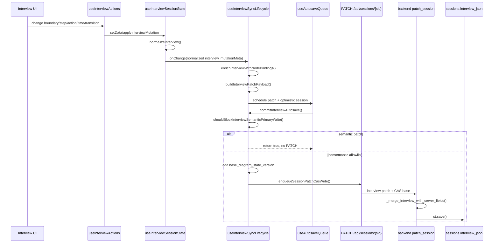

# Аудит primary write contract Interview

Дата аудита: 2026-05-05

Контур: `audit/interview-primary-write-contract-v1`

Ограничения: audit-only; product code, frontend, backend и schema не менялись.

## 1. Source truth

| Поле | Значение |
| ----- | -------- |
| repo | `/private/tmp/processmap_audit_interview_primary_write_contract_v1` |
| branch | `audit/interview-primary-write-contract-v1` |
| HEAD | `67b8b463c79becdd434967339c7643fb38d6e0e5` |
| origin/main | `67b8b463c79becdd434967339c7643fb38d6e0e5` |
| merge-base | `67b8b463c79becdd434967339c7643fb38d6e0e5` |
| git status на старте | `## audit/interview-primary-write-contract-v1...origin/main` |
| app version source | `v1.0.99`, `frontend/src/config/appVersion.js` |
| audit date | 2026-05-05 |
| runtime availability | `/api/health`, `/api/meta`, `/app` доступны read-only |
| served runtime metadata | `/api/meta`: `runtime.app_version=unknown`, `build_id=unknown`, `git_sha=null` |
| authenticated Interview runtime | не проверялся; stage не мутировался |
| GSD route | `GSD_FALLBACK_MANUAL_AUDIT_ONLY`: `gsd` CLI не найден, `gsd-sdk` найден, `.planning` отсутствует |

Ветка создана от актуального `origin/main`. Контур `feature/interview-analysis-namespace-guard-v1` не использовался как base; его результат уже попал в `origin/main` squash-коммитом `67b8b46` (`feat: preserve interview analysis namespace (#271)`).

## 2. Executive summary

Primary write contract сейчас неполный и небезопасный для новых persistable user fields.

Короткий ответ:
- Primary user write в UI задуман как `useInterviewActions` -> `useInterviewSessionState` -> `useInterviewSyncLifecycle.handleInterviewChange` -> `PATCH /api/sessions/{sid}` с `interview`, иногда `nodes`, `edges`.
- На практике semantic primary autosave заблокирован frontend guard'ом `shouldBlockInterviewSemanticPrimaryWrite()`.
- Разрешены только nonsemantic allowlist patches: `interview.ai_questions_by_element` / `aiQuestionsByElementId` и `interview.report_build_debug`, а также mutation types `diagram.ai_questions_by_element.update` и `paths.report_build_debug.update`.
- Projection/hydration writes из BPMN persistable и идут отдельными путями с CAS.
- Backend contract для `PATCH /sessions` нормальный: `interview` является diagram truth key, требует `base_diagram_state_version`, merge сохраняет `analysis`, `report_versions`, `path_reports`.
- Обычные изменения границ, шагов, ролей, времени, переходов и AI answers/status локально меняют state, но текущий frontend autosave возвращает success without PATCH для semantic patch.
- `feature/bpmn-product-action-properties-v1` не стоит начинать как persistable product-action UI, пока нет explicit writer/helper для `interview.analysis` или исправленного primary autosave contract.

Decision: `PRIMARY_WRITE_CONTRACT_BLOCKED`.

Минимальный следующий шаг: `feature/interview-analysis-patch-helper-v1` или `fix/interview-primary-autosave-contract-v1`.

## 3. User action map

| User action | UI component/file | State mutation | Should persist? | Current write path | Allowed/blocked? | Evidence |
| ----------- | ----------------- | -------------- | --------------- | ------------------ | ---------------- | -------- |
| Изменение границ процесса | `BoundariesBlock.jsx` -> `patchBoundary()` | `interview.boundaries.*` | Да | `setData` -> normalized `onChange` -> autosave | Blocked | `useInterviewActions.js:261`, `BoundariesBlock.jsx:204`, `useInterviewSyncLifecycle.js:249` |
| Reset границ | `useInterviewActions.resetBoundaries()` | `interview.boundaries` | Да | `setData` -> autosave | Blocked | `useInterviewActions.js:350`, `useInterviewSyncLifecycle.js:249` |
| Добавление шага | `TimelineControls`/`InterviewStage` -> `addStep()`/`addStepAfter()` | `interview.steps[]`, `subprocesses[]` | Да | `applyInterviewMutation(... type=interview.add_step)` -> immediate flush | Blocked | `useInterviewActions.js:383`, `useInterviewActions.js:409`, `useInterviewSyncLifecycle.js:780`, `useInterviewSyncLifecycle.js:249` |
| Быстрое добавление шага | `addQuickStepFromInput()` | `interview.steps[]` | Да | `addStepAfter()` | Blocked | `useInterviewActions.js:445` |
| Редактирование названия шага | `TimelineTable.jsx` | `interview.steps[].action` | Да | debounced `patchStep()` -> `setData` -> autosave | Blocked | `TimelineTable.jsx:1478`, `useInterviewActions.js:452`, `useInterviewSyncLifecycle.js:249` |
| Редактирование типа шага | `TimelineTable.jsx` | `interview.steps[].type` | Да | `patchStep()` -> autosave | Blocked | `TimelineTable.jsx:1492`, `useInterviewActions.js:452` |
| Редактирование subprocess/stage | `TimelineTable.jsx`, group actions | `interview.steps[].subprocess`, `interview.subprocesses[]` | Да | `patchStep()` или `groupStepsToSubprocess()` | Blocked | `TimelineTable.jsx:1504`, `useInterviewActions.js:814` |
| Редактирование зоны/роли | `TimelineTable.jsx` | `interview.steps[].area`, `role` | Да | debounced `patchStep()` | Blocked | `TimelineTable.jsx:1514`, `TimelineTable.jsx:1524` |
| Work duration | `TimelineTable.jsx`, `InterviewPathsView` | `work_duration_sec`, `duration_sec`, `step_time_sec`, `duration_min`, `step_time_min` | Да | `patchStep()` | Blocked | `TimelineTable.jsx:1537`, `useInterviewPathsViewController.js:542` |
| Wait duration | `TimelineTable.jsx`, `InterviewPathsView` | `wait_duration_sec`, `wait_sec`, `wait_min` | Да | `patchStep()` | Blocked | `TimelineTable.jsx:1555`, `useInterviewPathsViewController.js:556` |
| Output/result | `TimelineTable.jsx` | `interview.steps[].output` | Да | debounced `patchStep()` | Blocked | `TimelineTable.jsx:1569` |
| Comment/annotation text | `TimelineTable.jsx` | `interview.steps[].comment` | Да | debounced `patchStep()` | Blocked for Interview; BPMN annotation action has separate BPMN/node path | `TimelineTable.jsx:1606`, `useInterviewActions.js:1071` |
| Manual BPMN node binding | `TimelineTable.jsx`, Binding assistant | `interview.steps[].node_id`, `bpmn_ref` | Да | `patchStep()` / `applyStepBindings(type=interview.bind_steps)` | Blocked | `TimelineTable.jsx:1580`, `useInterviewActions.js:940` |
| Удаление шага | `TimelineTable.jsx`, selection actions | `steps`, `transitions`, `ai_questions`, `__deleted_node_ids` | Да | `applyInterviewMutation(... type=interview.delete_step)` -> immediate flush | Blocked | `TimelineTable.jsx:1453`, `InterviewStage.jsx:813`, `useInterviewActions.js:859`, `useInterviewSyncLifecycle.js:781` |
| Reorder steps | `moveStep()` | `steps`, optional linear `transitions` | Да | `applyInterviewMutation(... type=interview.reorder_steps)` -> immediate flush | Blocked | `useInterviewActions.js:780`, `useInterviewSyncLifecycle.js:785` |
| Изменение transition condition | `TransitionsBlock` -> `patchTransitionWhen()` | `interview.transitions[].when` | Да | `setData` -> autosave | Blocked | `useInterviewActions.js:481` |
| Add/update transition | `BpmnBranchesPanel` -> `addTransition()` | `interview.transitions[]`, maybe auto-bound steps | Да | `applyInterviewMutation(... type=interview.add_transition/update_transition)` -> immediate flush | Blocked | `useInterviewActions.js:509`, `useInterviewActions.js:737`, `useInterviewSyncLifecycle.js:782` |
| AI question status | AI cue/actions -> `patchQuestionStatus()` | `interview.ai_questions[stepId][].status` | Да | `setData` -> autosave | Blocked | `useInterviewActions.js:1576` |
| AI question delete | AI cue/actions -> `deleteAiQuestion()` | `interview.ai_questions[stepId]` | Да | `setData` -> autosave | Blocked | `useInterviewActions.js:1236` |
| AI questions generate | `addAiQuestions()` | backend writes `questions_json`, `ai_llm_state_json`, `interview.ai_questions`; frontend also `setData` | Да | `POST /api/sessions/{sid}/ai/questions` plus local state | Backend persistable; frontend local follow-up blocked if it differs | `useInterviewActions.js:1254`, `_legacy_main.py:4330`, `_legacy_main.py:4523` |
| AI questions by element | `addAiQuestionsNote()` | `interview.ai_questions_by_element` | Да | `setData`; allowlist by key if patch contains only this namespace | Allowed only as nonsemantic allowlist | `useInterviewActions.js:1100`, `useInterviewSyncLifecycle.js:142` |
| Path/spec/report interactions | `InterviewPathsView` | Reports via APIs; duration edits via `patchStep` | Reports yes; duration yes | Report APIs write backend; duration via autosave | Reports allowed; duration blocked | `InterviewPathsView.jsx:1898`, `InterviewPathsView.jsx:2026`, `useInterviewPathsViewController.js:542` |
| Timeline filters/UI preferences | `TimelineControls`, `useInterviewActions` | localStorage UI prefs | UI-only | `localStorage` | Allowed local-only | `useInterviewActions.js:274`, `useInterviewActions.js:298` |
| Advanced/debug report build debug | `InterviewStage.handleReportBuildDebug()` | `interview.report_build_debug` | Diagnostic yes | `applyInterviewMutation(type=paths.report_build_debug.update)` | Allowed nonsemantic | `InterviewStage.jsx:343`, `useInterviewSyncLifecycle.js:155` |
| Future analysis/product_actions candidate | future UI | `interview.analysis.product_actions[]` | Да | If generic Interview autosave: `interview` patch | Blocked unless explicit writer/helper or allowlist is added | `useInterviewSyncLifecycle.js:163`, `processStageDomain.js:26`, `_legacy_main.py:1009` |

## 4. Primary write pipeline map

Pipeline answers:
- Mutation classification lives in `useInterviewSyncLifecycle.isNonSemanticInterviewAllowlistPatch()` and `shouldBlockInterviewSemanticPrimaryWrite()`.
- Autosave is enabled by `useAutosaveQueue({ debounceMs: 120, onSave: commitInterviewAutosave })`.
- Semantic write block is executed before any `PATCH` in `commitInterviewAutosave()`.
- PATCH payload is built by `buildInterviewPatchPayload(nextInterview, nextNodes, baseNodes, nextEdges, baseEdges)`.
- `base_diagram_state_version` is read from `getBaseDiagramStateVersion()` and then resolved again at send time by `enqueueSessionPatchCasWrite()`.
- Local version context is updated through `rememberDiagramStateVersion()` from ack or 409 server current version.

## 5. Allowlist/blocklist map

| Guard/function | File | Blocks what | Allows what | Why exists | Risk |
| -------------- | ---- | ----------- | ----------- | ---------- | ---- |
| `isAllowedNonSemanticInterviewPatchKey()` | `frontend/src/features/process/hooks/useInterviewSyncLifecycle.js:142` | Any interview key except three allowed debug/AI keys | `ai_questions_by_element`, `aiQuestionsByElementId`, `report_build_debug` | Single-writer guard for nonsemantic patches | New semantic namespaces such as `analysis` are blocked by generic autosave |
| `isNonSemanticInterviewAllowlistPatch()` | `useInterviewSyncLifecycle.js:147` | Any patch not exactly allowlisted | mutation types `diagram.ai_questions_by_element.update`, `paths.report_build_debug.update`; one-key `interview` patch with only allowed keys | Permit diagnostic/enrichment saves without recompute | Normal user data and future product action data cannot persist through this path |
| `shouldBlockInterviewSemanticPrimaryWrite()` | `useInterviewSyncLifecycle.js:163` | Every non-empty patch that is not allowlisted | Empty patch or nonsemantic allowlist patch | Prevent semantic Interview primary writer from competing with BPMN/projection writers | It silently returns success without PATCH for user edits |
| `commitInterviewAutosave()` block branch | `useInterviewSyncLifecycle.js:208` | Network write for semantic Interview patch | Logging only: `interview.autosave_semantic_primary_write_blocked` | Operational guard around old save conflicts | User sees optimistic state, but durable DB may not receive edit |
| `enqueueSessionPatchCasWrite()` | `sessionPatchCasCoordinator.js:61` | Does not block semantic writes; serializes writes and attaches fresh base | CAS-safe session patches | Avoid same-client stale base conflict | Good pattern, but not reached for semantic primary autosave |
| Backend CAS `_require_diagram_cas_or_409()` | `backend/app/_legacy_main.py:873` | HTTP diagram truth writes without or with stale base | Direct unit harness without request; correct base | Protect diagram/session truth | Correct; should not be weakened |

Existing source tests explicitly lock the guard shape in `frontend/src/features/process/hooks/useInterviewSyncLifecycle.single-writer-guard.test.mjs`.

## 6. Writers classification

| Writer | File/function | Type | Payload | Persistable user input? | Should own analysis? |
| ------ | ------------- | ---- | ------- | ----------------------- | -------------------- |
| Interview UI autosave | `useInterviewSyncLifecycle.handleInterviewChange` -> `commitInterviewAutosave` | Intended primary user input | `interview`, optional `nodes`, `edges` | Currently blocked for semantic input | No, until explicit analysis writer exists |
| Interview local state | `useInterviewSessionState` | Local state emitter | normalized `interview` | Local/optimistic only | No direct backend ownership |
| Interview actions | `useInterviewActions` | UI mutation source | boundaries, steps, transitions, AI maps, exceptions | Should persist, but autosave blocks semantic patches | No direct backend ownership |
| BPMN hydration | `hydrateInterviewFromBpmn` | projection/hydration | `interview`, optional `nodes`, `edges` | Projection, not primary user edit | Preserve only; should not own analysis semantics |
| Tab switch sync | `useProcessTabs` | projection/hydration | `interview` | Projection, not primary user edit | Preserve only |
| Diagram autosave projection | `useDiagramMutationLifecycle` | projection after BPMN XML write | projection patch | Projection, not primary user edit | Preserve only |
| Manual save/import/restore companion | `ProcessStage` | projection after BPMN write/import | projection patch | Projection, not primary user edit | Preserve only |
| Report APIs | `_create_path_report_version_core`, `_patch_report_version_row`, delete/list helpers | report/output | `interview.report_versions`, `path_reports` | Output/history | No |
| AI questions backend | `ai_questions`, `_sync_interview_ai_questions_for_node` | AI enrichment | `questions_json`, `ai_llm_state_json`, `interview.ai_questions` | Enrichment, not primary manual edit | No |
| Report build debug | `InterviewStage.handleReportBuildDebug` | debug/diagnostic | `interview.report_build_debug` | Diagnostic only | No |
| UI preferences | `saveUiPrefs` | UI-only preference | localStorage | No DB truth | No |

## 7. Backend contract

Backend accepts `PATCH /api/sessions/{sid}` with `UpdateSessionIn.interview: Optional[Any]`.

| Backend function | Role | Interview behavior | CAS behavior | Risk |
| ---------------- | ---- | ------------------ | ------------ | ---- |
| `_DIAGRAM_TRUTH_PATCH_KEYS` | Classifies diagram/session truth patch keys | Includes `interview`, `nodes`, `edges`, `questions`, `status`, `bpmn_meta` | Triggers CAS requirement | Correct; Interview patches are durable truth writes |
| `_resolve_base_diagram_state_version()` | Reads request precondition | Payload/header/query `base_diagram_state_version` or compatible keys | Supplies base to CAS guard | Correct |
| `_require_diagram_cas_or_409()` | Enforces CAS | Rejects missing/stale base for real HTTP requests | 409 with server current version | Correct; do not silence |
| `patch_session()` | Main PATCH endpoint | Calls `_merge_interview_with_server_fields(sess.interview, incoming)` | Marks diagram truth write and increments `diagram_state_version` | Backend can persist Interview if frontend sends PATCH |
| `_merge_interview_with_server_fields()` | Server merge boundary | Normalizes incoming; preserves/merges `analysis`; preserves `report_versions`/`path_reports` | n/a | Namespace guard is present in current `origin/main` |
| `_preserve_current_interview_analysis_before_save()` | Report/AI race safeguard | Re-loads current session and preserves `analysis` before `st.save()` | No diagram CAS; local guard only | Helps `analysis`, but not a general primary write contract |
| `_sync_interview_ai_questions_for_node()` | AI enrichment | Mutates `interview.ai_questions` | No diagram CAS | Enrichment writer; should not own product actions |
| `_patch_report_version_row()` / report create/delete | Report output | Mutates `report_versions` and `path_reports` | No diagram CAS; report lock | Output writer; analysis is preserved |

Backend successful write means:
- CAS precondition passes for diagram truth keys.
- `sess.interview` is updated through merge helper.
- `_mark_diagram_truth_write()` increments `diagram_state_version`.
- `st.save()` persists the session row.

The blocker is not backend; it is the frontend semantic primary autosave guard.

## 8. Runtime/source scenarios

Stage runtime was checked read-only only. Authenticated mutation proof was not performed.

| Scenario | Expected write | Current source behavior | Verdict |
| -------- | -------------- | ----------------------- | ------- |
| edit boundary | `PATCH { interview }` with base | local state emits, autosave blocks before PATCH | Blocked |
| add step | `PATCH { interview, nodes? }` with base | immediate flush requested, autosave blocks before PATCH | Blocked |
| edit step action/role/area | `PATCH { interview, nodes? }` with base | debounced state update, autosave blocks before PATCH | Blocked |
| edit work/wait duration | `PATCH { interview, nodes? }` with base | `patchStep()` updates local state, autosave blocks | Blocked |
| edit transition | `PATCH { interview, edges? }` with base | immediate flush for add/update; block before PATCH | Blocked |
| AI question comment/status | `PATCH { interview }` with base | generic local `setData`; block unless only `ai_questions_by_element` key | Mostly blocked |
| report debug update | `PATCH { interview: { report_build_debug } }` with base | allowlisted nonsemantic path | Allowed |
| future product_action edit | explicit `analysis` patch or generic `interview` patch | generic path blocked; explicit helper does not exist yet | Needs helper |
| BPMN projection/hydration | `PATCH { interview, nodes?, edges? }` with base | separate projection path sends PATCH | Allowed projection |

Runtime proof status: `SOURCE_ONLY_INTERVIEW_PRIMARY_WRITE_AUDIT_READY`.

## 9. Product actions implication

If tomorrow a UI writes product action fields through generic Interview state, they will not be durable. The user interaction would become a semantic `interview` patch and hit `shouldBlockInterviewSemanticPrimaryWrite()`.

Recommended product-actions storage remains `interview.analysis.product_actions[]`, not BPMN XML. But persistence needs an explicit analysis writer/helper before product-action UI work.

| Candidate write path | Can persist now? | Risk | Recommended use |
| -------------------- | ---------------- | ---- | --------------- |
| step fields inside `interview.steps[]` | No through current UI autosave | Semantic patch blocked; projection may rewrite selected step fields | Do not use for product action truth |
| `interview.analysis.product_actions[]` via generic Interview autosave | No | Namespace preserved if it reaches backend, but frontend semantic guard blocks PATCH | Not sufficient |
| `interview.analysis.product_actions[]` via explicit helper | Future yes | Helper must attach CAS base, preserve namespace, avoid blind retry | Preferred minimal next contour |
| `bpmn_meta.product_action_by_element_id` | Not yet | Needs explicit meta schema/key support; meta is hint/mirror, not primary action truth | Later element-level mirror/hints |
| BPMN XML extension elements | No | Violates current truth split and increases BPMN XML coupling | Do not use for this MVP |
| dedicated backend endpoint | Future yes | Needs API/permissions/CAS design | Good later if analysis grows beyond session PATCH |

Minimal safe MVP:
- add `patchInterviewAnalysis(sessionId, analysisPatch)` or equivalent bounded helper;
- route product-actions edits through this helper;
- keep projection/report/AI as preserve-only writers;
- do not rely on generic Interview autosave for product-actions.

## 10. Decision

`PRIMARY_WRITE_CONTRACT_BLOCKED`

Причина:
- Normal Interview user edits are semantic writes.
- `shouldBlockInterviewSemanticPrimaryWrite()` blocks all non-allowlisted semantic patches before network.
- The backend can persist `interview` safely, and `analysis` namespace is guarded in `origin/main`, but the intended frontend primary autosave path currently does not send normal semantic writes.

Decision-ready answer:
- Do not start `feature/bpmn-product-action-properties-v1` as a persistable product-actions UI contour yet.
- First implement `feature/interview-analysis-patch-helper-v1` or `fix/interview-primary-autosave-contract-v1`.

## 11. Recommended follow-up contours

| Priority | Contour | Goal | Why | Validation |
| -------- | ------- | ---- | --- | ---------- |
| P0 | `feature/interview-analysis-patch-helper-v1` | Add explicit CAS-aware writer for `interview.analysis` | Product actions need durable writes without depending on blocked generic autosave | Unit/source tests: analysis patch sends PATCH, preserves sibling keys, 409 remains visible |
| P0 | `fix/interview-primary-autosave-contract-v1` | Decide and implement allowed semantic primary Interview writes or explicit writer taxonomy | Current normal Interview edits look local/optimistic only | Source tests plus local runtime mutation smoke |
| P1 | `feature/bpmn-product-action-properties-v1` | Add BPMN element/task-level product action hints | Safe only after durable writer exists | Save/reload one session; no BPMN XML truth change |
| P1 | `feature/product-action-taxonomy-dictionaries-v1` | Dictionaries for action type/stage/object/method | Needed for structured export | Unit + UI smoke |
| P1 | `feature/product-actions-extraction-from-bpmn-v1` | Build product action rows from BPMN + Interview | Requires durable `analysis.product_actions[]` | Fixture tests preserve manual corrections |

## 12. Final verdict

`SOURCE_ONLY_INTERVIEW_PRIMARY_WRITE_AUDIT_READY`

Contract verdict: `PRIMARY_WRITE_CONTRACT_BLOCKED`

Explicit safety:

| Item | Status |
| ---- | ------ |
| product code changed | no |
| frontend changed | no |
| backend changed | no |
| DB/schema changed | no |
| migration | no |
| BPMN XML truth changed | no |
| product actions UI/export added | no |
| top-level labels changed | no |
| merge | no |
| deploy | no |
| PR | no |
