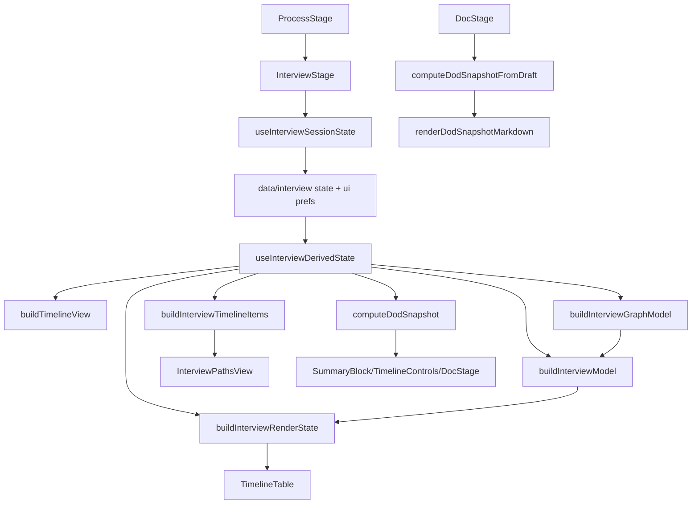

# Interview Decomposition Audit (A1/5)

## Scope
- Цель этого этапа: только аудит, карта домена и план декомпозиции без рефакторинга кода.
- Фокус: Interview pipeline, варианты прохождения (P0/P1/P2), DoD/coverage/time, и причины нестабильного порядка в сценариях.

## 1) Инвентаризация текущих сущностей и потоков данных

### 1.1 Где формируется BPMN-граф
- `frontend/src/components/process/interview/graph/buildGraphModel.js:172`
  - Основной конструктор графа: `buildInterviewGraphModel(...)`.
  - Приоритет source:
    - XML sequenceFlow, если есть (`flowSourceMode: "xml_sequence_flow"`), `:197-203`.
    - runtime edges fallback, если XML flow не найден (`:201-203`).
  - Reachability, split/join, join-кандидаты и start fallback рассчитываются тут (`:283-423`).

### 1.2 Где строится Interview timeline
- `frontend/src/components/process/interview/timelineViewModel.js:149`
  - Базовая нормализация steps в `buildTimelineView(...)`.
  - Если steps пусты, создаются fallback-steps из backend nodes (`:157-161`), включая дефолтные длительности (`:29-44`).
  - Порядок в основном по `_graph_rank` (`:262-270`) + дополнительная иерархия subprocess (`:72-147`).

- `frontend/src/components/process/interview/model/buildInterviewModel.js:359`
  - Mainline traversal, branch preview, between-branches, loop markers, time summary, canonical nodes.
  - Primary-branch selection: `P0 > P1 > default > shortest_path > tie-break` (`:210-305`).

- `frontend/src/components/process/interview/viewmodel/buildInterviewRenderState.js:7`
  - Режимы отображения: `flat/mainline/full`, feature flags и fallback-механизм (`:150-177`).

### 1.3 Где считаются DoD / coverage / time
- `frontend/src/features/process/dod/computeDodSnapshot.js:1000`
  - Единый тяжелый расчет snapshot.
  - Внутри:
    - повторный парсинг BPMN XML (`parseBpmnFacts`, `:218-361`),
    - повторная сборка graph+model при отсутствии переданных моделей (`buildModelsFromDraft`, `:396-500`),
    - расчет quality/items/metrics/lanes/time/tiers/steps/graph.

### 1.4 Где строятся варианты прохождения (P0/P1/P2)
- Interview matrix branch block:
  - `frontend/src/components/process/interview/model/buildInterviewModel.js:693-771` (branch previews),
  - `:845-891` (between-branches в timeline row).
- Interview Paths view:
  - `frontend/src/components/process/interview/viewmodel/buildTimelineItems.js:3-21` (step + between item),
  - `frontend/src/components/process/interview/InterviewPathsView.jsx:62-135` (рендер branch nodes).
- DOC “Варианты прохождения”:
  - `frontend/src/components/process/DocStage.jsx:68-104` (`buildScenarioRows`) — фильтрует по tier.

### 1.5 Где рендерится UI “Варианты прохождения процесса” и как сортируются строки
- В Interview (Paths): порядок идет в порядке `timelineItems`, который строится из `timelineView` без отдельной сортировки (`buildTimelineItems.js:5-20`).
- В DOC (Report): “scenario rows” получаются фильтрацией `snapshot.steps` и `betweenBranchesSummary.rows` по tier (`DocStage.jsx:68-104`) без отдельного path-order key.

## 2) Карта текущего пайплайна данных



## 3) Точки смешивания слоёв (факты)

1. **Derived hook одновременно оркестрирует domain + viewmodel + snapshot + debug**
   - `useInterviewDerivedState.js:236-323`.
2. **Domain model создает UI-специфичные структуры**
   - `buildInterviewModel.js:845-891` (`between_branches_item`), `:893-975` (`canonicalNodes` для UI).
3. **DoD snapshot снова собирает graph/model и повторяет parsing**
   - `computeDodSnapshot.js:396-500`.
4. **Timeline fallback генерирует искусственные step duration/типы прямо в pipeline**
   - `timelineViewModel.js:17-50`.
5. **Варианты в DOC считаются из tier-filter projection, а не из graph traversal path**
   - `DocStage.jsx:68-104`.
6. **Render mode/fallback бизнес-решения внутри viewmodel builder**
   - `buildInterviewRenderState.js:150-177`.
7. **UI компонент TimelineTable содержит много доменной логики ветвлений/tiers/time**
   - `TimelineTable.jsx:533-1234`.
8. **Параллельно существуют несколько “источников порядка”:**
   - node order из XML scan (`computeDodSnapshot.js:258-287`),
   - graph rank (`computeGraphNodeRank`, `:386-394`),
   - traversal mainline (`buildInterviewModel.js:483-521`).
9. **Интервьюшные steps и BPMN-derived fallback steps смешиваются рано**
   - `buildTimelineView(...):157-161`.
10. **Persistence/UI prefs и domain-mutations смешаны в actions/state hooks**
   - `useInterviewSessionState.js:101-126`, `:189-224`,
   - `useInterviewActions.js:283-312`.

## 4) Черновик цельной доменной модели

### Core domain entities
- `Graph`
  - `nodesById`, `flowsById`, `outgoingByNode`, `incomingByNode`, `startNodeIds`, `endNodeIds`, `gatewayById`.
- `Flow`
  - `id`, `sourceId`, `targetId`, `condition`, `tier`, `isPrimary`.
- `Lane/Pool`
  - `laneId`, `laneName`, `poolId`, `poolName`, `nodeIds`.
- `LinkGroup`
  - `linkKey`, `throwIds`, `catchIds`, `integrity`.
- `InterviewStep`
  - `stepId`, `nodeBindId`, `title`, `lane`, `duration`, `notes`, `ai`.
- `Scenario`
  - `mainline`, `branches`, `betweenBlocks`, `loops`, `orderKey`.
- `Metrics`
  - `counts`, `tierCounts`, `timeByLane`, `timeByTier`, `coverage`.
- `Quality`
  - issues list + summary, классификация по graph integrity.

## 5) Целевая модульная схема (границы ответственности)

```text
frontend/src/features/interview/
  domain/
    graphTypes.js
    interviewTypes.js
    scenarioTypes.js
    tierRules.js
    orderRules.js
    qualityRules.js
    timeRules.js
  adapters/
    bpmnXmlAdapter.js
    runtimeDraftAdapter.js
    flowMetaAdapter.js
    notesAiAdapter.js
  services/
    buildGraphService.js
    buildInterviewModelService.js
    buildScenarioService.js
    computeMetricsService.js
    computeQualityService.js
    computeDodSnapshotService.js
  selectors/
    selectTimelineRows.js
    selectBetweenBranchBlocks.js
    selectScenarioRows.js
    selectSummaryMetrics.js
    selectQualityView.js
  ui/
    Timeline/
    Paths/
    Diagram/
    DocReport/
  tests/
    domain/
    services/
    selectors/
```

### Правила границ
- `domain/` не импортирует React и DOM.
- `adapters/` переводят внешние форматы в доменную модель.
- `services/` только pure business rules.
- `selectors/` только композиция уже рассчитанной доменной модели под UI.
- `ui/` не считает graph/tier/order напрямую.

## 6) Top-10 узких мест (файл/функция → почему ломает → что будет после декомпозиции)

| # | Файл / функция | Почему ломает порядок/логику | После декомпозиции |
|---|---|---|---|
| 1 | `useInterviewDerivedState.js` / главный хук | Слишком много обязанностей: graph+model+snapshot+debug+filters | Хук станет только orchestration/selectors wiring |
| 2 | `buildTimelineView` (`timelineViewModel.js`) | Подмешивает fallback автогенерацию step и времени (`:157-161`) | Fallback вынести в adapter, включать явно по флагу |
| 3 | `buildInterviewModel` | Domain + UI glue (`between_branches_item`, `canonicalNodes`) в одном сервисе | Разделить: `buildInterviewModelDomain` + `buildInterviewTimelineViewModel` |
| 4 | `computeDodSnapshot` | Повторный parse/build graph/model, дубли логики и несогласованность | Snapshot только читает каноническую domain model |
| 5 | `computeGraphNodeRank` в snapshot | Порядок от XML scan order, не от traversal path | Единый `path_order` из scenario service |
| 6 | `DocStage.buildScenarioRows` | Tier-фильтр rows без route semantics, теряется “человеческий порядок” | `selectScenarioRows(tier)` на основе branch graph nodes |
| 7 | `TimelineTable.jsx` | UI-компонент содержит бизнес-логику tiers/outcomes/branch state | Перенести вычисления в selectors/viewmodel |
| 8 | `buildInterviewRenderState` | Бизнес fallback-режимы и runtime anomaly detection в viewmodel | Режимы формировать в service policy, UI только отображает |
| 9 | `useInterviewSessionState` + `useInterviewActions` | Persistence, localStorage и domain mutation связаны | Отдельный `uiPrefsStore` + `interviewCommandHandlers` |
|10| `InterviewPathsView.jsx` | Рендерит сырые nodes, отображение зависит от неканонического item order | Получать уже отсортированный `pathsViewModel` с стабильным `orderKey` |

## 7) План рефакторинга по этапам (минимальные безопасные шаги)

### Этап 1 — Контракты и “заморозка” поведения
1. Зафиксировать текущие контракты в `domain/*Types`.
2. Добавить snapshot-тесты на текущий `timelineView` и `DocStage scenario rows` (baseline).
3. Ввести `orderKey/pathOrder` в viewmodel без изменения UI.

### Этап 2 — Вынос доменной логики
1. Вынести graph build в `services/buildGraphService`.
2. Вынести scenario/mainline/branch traversal в `services/buildScenarioService`.
3. `buildInterviewModel` оставить как thin wrapper.

### Этап 3 — Snapshot консолидация
1. `computeDodSnapshot` перестает строить graph/model внутри.
2. Snapshot принимает только канонический `graph + interviewModel + quality`.
3. Удалить дублирующие локальные подсчеты из UI.

### Этап 4 — UI-селекторы
1. Вынести вычисления для Timeline/Paths/Doc в `selectors/*`.
2. `TimelineTable`, `InterviewPathsView`, `DocStage` переводятся на selectors.

### Этап 5 — Чистка legacy веток
1. Фоллбэки “авто-step generation” оставить только как controlled mode.
2. Удалить устаревшие mixed-пути, где ordering шел от XML scan / runtime fallback.
3. Регрессии закрыть e2e пакетом Interview + Doc + save/reload.

## 8) Что именно объясняет текущий симптом “позитивный сценарий не по порядку”

- В DOC “варианты” собираются проекцией по `tier`, а не непрерывным проходом выбранного сценария (`DocStage.jsx:68-104`).
- В snapshot порядок промежуточно зависит от `node.order` (XML scan) и fallback-рангов (`computeDodSnapshot.js:258-287`, `:386-394`), что может конфликтовать с expected mainline traversal.
- В pipeline присутствует fallback генерация шагов с предустановленным временем (`timelineViewModel.js:29-44`, `:157-161`), что визуально выводит “time-rich” шаги раньше ожидаемого пользовательского сценария при деградации исходных steps.

---

Этот документ — только аудит и план A1/5. Изменения кода не выполнялись.
