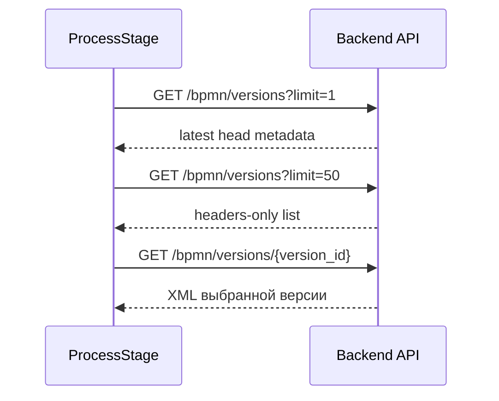

## fix/bpmn-history-headers-default-and-lazy-xml-v1

> [!summary] Цель
> История BPMN-версий должна грузить список headers-only. XML конкретной версии загружается только при preview/restore.

| Метрика | До | После | Комментарий |
| ------- | -- | ----- | ----------- |
| Initial `limit=50` calls | 3 x `GET /api/sessions/{id}/bpmn/versions?limit=50` | source path переведен на `limit=1` для head; список грузится при открытии модалки | Тройной list-запрос не должен быть default initial load |
| List includes XML | риск через `include_xml=true` | no by default | `apiGetBpmnVersions` не отправляет `include_xml`, пока `includeXml !== true` |
| XML detail | bulk/list risk | selected version only | `apiGetBpmnVersion(sessionId, versionId)` |
| Duration | `1084-1469ms` each before | local source/test proof; stage pending | Runtime без deploy не снимался |
| Payload | около `36,684 bytes` each / больше при XML | headers-only list; XML одной версии | XML не должен входить в list path |

> [!success] Source proof
> `refreshLatestBpmnRevisionHead()` больше не запрашивает `BPMN_VERSION_HEADERS_LIMIT`; для badge/head используется `limit: 1`.

Связанные файлы:

| Файл | Изменение |
| ---- | --------- |
| `frontend/src/components/ProcessStage.jsx` | Dedupe list, head `limit=1`, lazy XML detail, stale guards |
| `frontend/src/components/ProcessStage.bpmn-history-loading.test.mjs` | Source-level regression tests |
| `frontend/src/config/appVersion.js` | `v1.0.96` |
