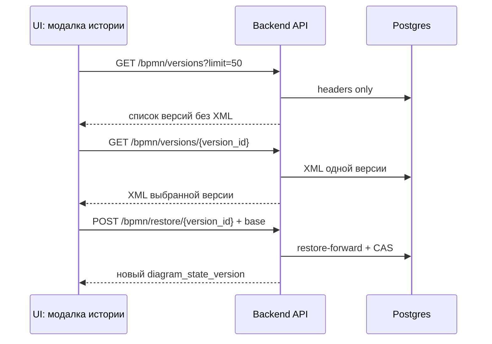

## BPMN history: headers-only list и lazy XML

> [!warning] Разделение contract'ов
> Remote head polling, history list и XML detail - разные сценарии. Нельзя использовать bulk history XML там, где нужен только статус/head/list.

| Сценарий | Endpoint | Должен содержать XML? | Комментарий |
| -------- | -------- | --------------------- | ----------- |
| Remote head | `GET /api/sessions/{id}/bpmn/versions?limit=1` | Нет | Только head metadata |
| History list | `GET /api/sessions/{id}/bpmn/versions?limit=50` | Нет | Headers only, `include_xml` не отправляется |
| Version preview | `GET /api/sessions/{id}/bpmn/versions/{version_id}` | Да, одной версии | Lazy detail |
| Restore | `POST /api/sessions/{id}/bpmn/restore/{version_id}` | Backend uses stored XML | CAS required |
| Create version | `POST /api/sessions/{id}/bpmn/versions` | Нет в list path | Отдельное publish/manual действие |

> [!success] UX contract
> Модалка истории открывает список один раз через `versionsOpen` effect. Preview/restore догружают XML выбранной версии лениво и не требуют XML всех версий.

Связанные функции:

| Функция | Роль |
| ------- | ---- |
| `refreshSnapshotVersions` | Headers/head fetch, dedupe, stale guard |
| `refreshLatestBpmnRevisionHead` | Head-only read с `limit=1` |
| `openVersionsModal` | Только открывает модалку; fetch выполняет effect |
| `ensureBpmnVersionXml` | Lazy detail fetch одной версии |
| `restoreSnapshot` | Restore by version id с CAS base |
