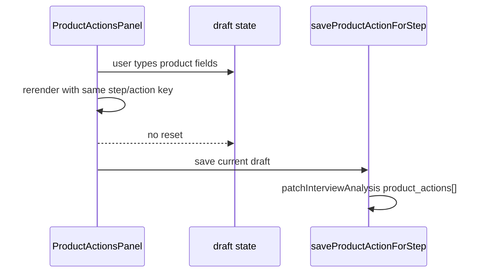

# fix/product-actions-panel-draft-reset-v1

> [!summary] Source-tested
> Исправлен blocker из `runtime/product-action-properties-stage-save-reload-proof-v1`: `ProductActionsPanel` больше не сбрасывает draft values из-за object-identity rerender, а пустой product action save заблокирован до network.

| Item | Значение |
| ---- | -------- |
| Worktree | `/tmp/processmap_fix_product_actions_panel_draft_reset_v1` |
| Branch | `fix/product-actions-panel-draft-reset-v1` |
| Base | `origin/main` = `e9a42682ab8dc11bf4cda10ed4ae22405f30a3ff` |
| App version | `v1.0.102` |
| Runtime blocker | `STAGE_PRODUCT_ACTION_UI_PASS_SAVE_BLOCKED` |
| Fix verdict | `SOURCE_TESTED_STAGE_PENDING` |

## Root Cause

| Code path | Before | After |
| --------- | ------ | ----- |
| `ProductActionsPanel` draft reset effect | depended on `selectedStep` and `editingAction` object references | guarded by stable `draftResetKey` + `lastDraftResetKeyRef` |
| Controlled inputs | local edits could be overwritten by rerender/hydration | draft is preserved while step/action id is unchanged |
| Empty save | could create empty row | save disabled until at least one meaningful field is filled |

## Validation

| Command | Result |
| ------- | ------ |
| `git diff --check` | pass |
| frontend targeted node tests | pass, `28/28` |
| backend namespace guard | pass, `7/7` |
| `npm --prefix frontend run build` | pass, existing Vite chunk warning |

> [!warning] Stage
> Deploy не выполнялся. После merge/deploy нужно повторить `runtime/product-action-properties-stage-save-reload-proof-v1` на safe session and verify marker values persist.

