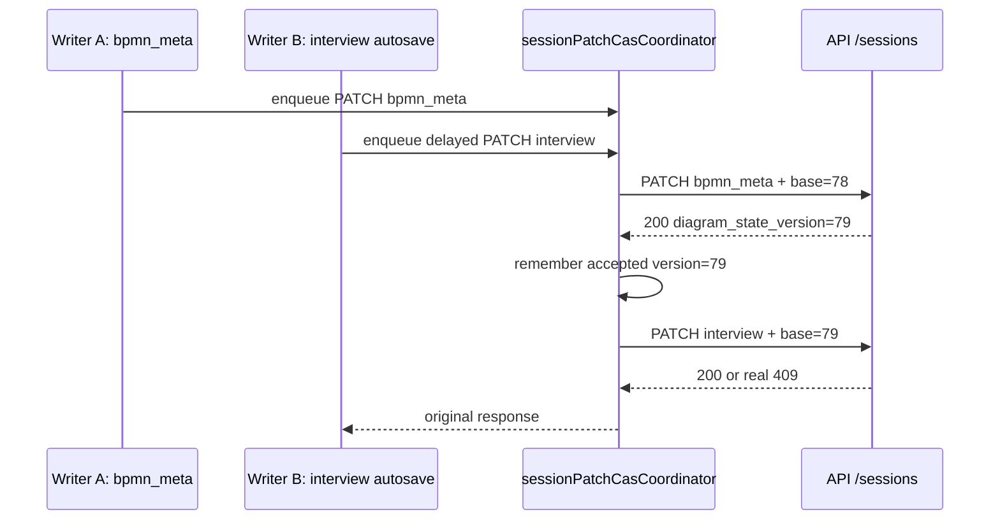

## fix/session-patch-cas-self-conflict-queue-v1

> [!summary] Цель
> Secondary `PATCH /api/sessions/{id}` writers берут актуальный `base_diagram_state_version` в момент отправки через общий per-session CAS coordinator.

| Writer | Payload keys | Base before | Base after | Risk |
| ------ | ------------ | ----------- | ---------- | ---- |
| `useInterviewSyncLifecycle` | interview/hydration | stale closure risk | `sessionPatchCasCoordinator` | delayed self-conflict |
| `useDiagramMutationLifecycle` | projection patch | direct send | shared queue | parallel secondary writers |
| `BpmnStage.persistSessionMetaBoundary` | `bpmn_meta` | direct send | shared queue | template/meta vs interview race |
| `ProcessStage` import/restore/manual projection | interview/projection | direct send | shared queue | secondary race |
| `useProcessTabs` | tab-switch interview sync | direct send | shared queue | stale base |
| `useSessionMetaWriteGateway` | `bpmn_meta` | local gateway queue | shared CAS coordinator | cross-writer race |

> [!warning] 409 не является шумом
> Coordinator предотвращает same-client stale-base conflicts. Реальные external conflicts остаются failed responses.

