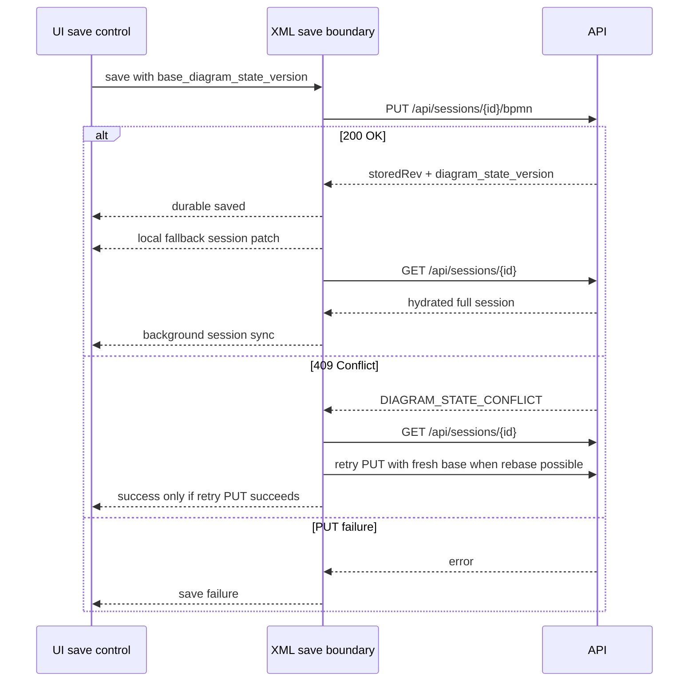

# 05_Карта сохранения и CAS

## Durable BPMN save ack отделён от background sync

> [!summary] Контракт
> Успешный `PUT /api/sessions/{id}/bpmn -> 200` является durable ack для BPMN XML. Полный `GET /api/sessions/{id}` после этого может обновлять session hydration в фоне, но не является условием успешного сохранения.

| Сценарий | Поведение |
| -------- | --------- |
| `PUT /bpmn 200` | UI может показать `Сохранено на сервере`; `diagram_state_version` берётся из ack |
| Background `GET /session` success | `onSessionSync` применяет hydrated session позже |
| Background `GET /session` failure | durable save остаётся successful; UI показывает warning/info о background refresh |
| `PUT /bpmn` failure | durable success не показывается |
| `PUT /bpmn 409` | conflict остаётся реальной save error, либо retry только через существующий rebase path |

> [!warning] CAS не скрывать
> `409 Conflict` после `PUT /bpmn` остаётся реальной ошибкой сохранения. Nonblocking sync относится только к успешному durable `PUT /bpmn`. Background refresh failure не должен маскировать save success, но и не должен скрывать failed durable write.

Source links:

| Файл / функция | Контракт |
| -------------- | -------- |
| `persistCamundaExtensionsViaCanonicalXmlBoundary` | `onDurableSaveAck` вызывается только после successful `apiPutBpmnXml` |
| `isDiagramStateConflict` | 409 / `DIAGRAM_STATE_CONFLICT` остаётся отдельной веткой |
| `buildFallbackSessionPatch` | local session state получает `bpmn_xml`, `bpmn_meta`, `bpmn_xml_version`, `diagram_state_version` из durable ack |
