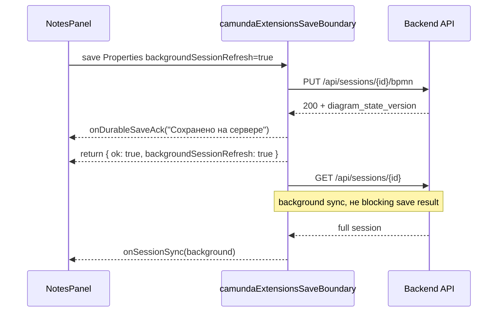

# 08_Карта производительности

## fix/session-refetch-after-bpmn-save-nonblocking-v1

> [!summary] Цель
> Durable `PUT /api/sessions/{id}/bpmn` должен завершать пользовательское сохранение. Тяжёлый `GET /api/sessions/{id}` может идти как background sync и не должен удерживать save status в blocking/busy состоянии.

| Метрика | До | После | Комментарий |
| ------- | -- | ----- | ----------- |
| `PUT /api/sessions/{id}/bpmn` | ~1.15s | source/test proof: durable ack сразу после `PUT 200` | Durable save truth остаётся на backend ack |
| `GET /api/sessions/{id}` after save | до 6.47s | background через `backgroundSessionRefresh` | Не блокирует возврат результата save path |
| Full session payload | 4,350,159 bytes / 3.41s fresh audit | payload не устранён, но вынесен из blocking save path | Payload decomposition не входит в этот contour |
| UI save busy | `PUT + GET /session` | `PUT /bpmn` only для hot property save path | `NotesPanel.jsx` снимает busy после durable result |
| Contour status | baseline | source-tested / stage-pending | Код уже присутствует в `origin/main` через PR #257 |

> [!success] Source proof
> `frontend/src/features/process/camunda/camundaExtensionsSaveBoundary.js` поддерживает `backgroundSessionRefresh`. При успешном `PUT /bpmn` он вызывает `onDurableSaveAck`, синхронизирует локальный fallback patch с `diagram_state_version`, запускает `apiGetSession` в background promise и сразу возвращает durable payload.

Связанные файлы:

| Файл | Роль |
| ---- | ---- |
| `frontend/src/features/process/camunda/camundaExtensionsSaveBoundary.js` | durable ack + background session refresh |
| `frontend/src/App.jsx` | прокидывает `backgroundSessionRefresh` и callbacks из UI |
| `frontend/src/components/NotesPanel.jsx` | показывает `Сохранено на сервере` после durable ack и `Обновляем состояние...` только как background phase |
| `frontend/src/components/sidebar/ElementSettingsControls.jsx` | отдельные состояния `saving`, `durable_saved`, `refreshing`, `error` |
