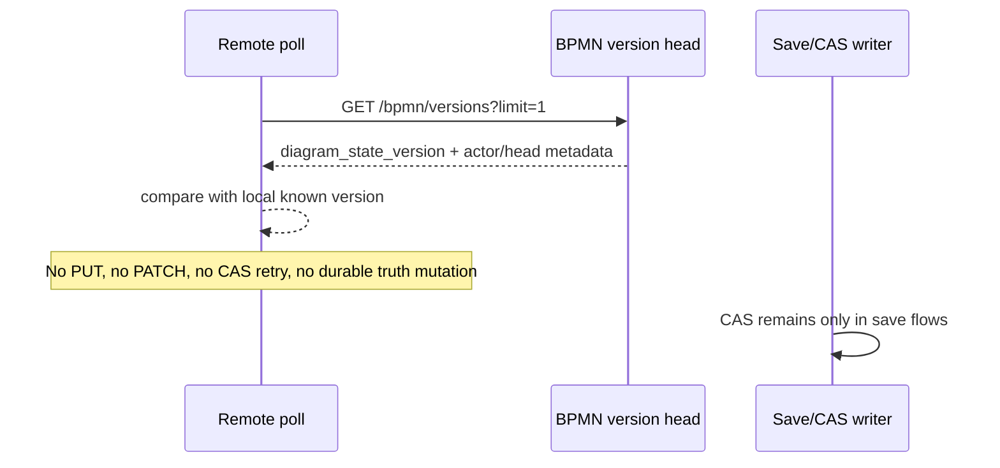

# 05_Карта сохранения и CAS

## Remote head polling отделён от save/CAS

> [!warning] Remote poll не является save writer
> Фоновая проверка обновлений не должна менять durable truth и не должна маскировать CAS-conflicts. Её задача — дешёво обнаружить, что серверная версия изменилась.

| Flow | Writer? | Durable truth changes? | Full session load? |
| ---- | ------- | ---------------------- | ------------------ |
| `PUT /api/sessions/{id}/bpmn` | yes | yes, через backend ack и CAS | no |
| `GET /api/sessions/{id}/bpmn/versions?limit=1` poll | no | no | no |
| Remote update indicator | no | no | no |
| Explicit refresh action | no write | hydrates local client state from server | yes, user initiated |

> [!success] CAS unchanged
> Save conflicts remain handled by existing save paths. This contour removes only automatic background `GET /session` escalation from remote poll.
