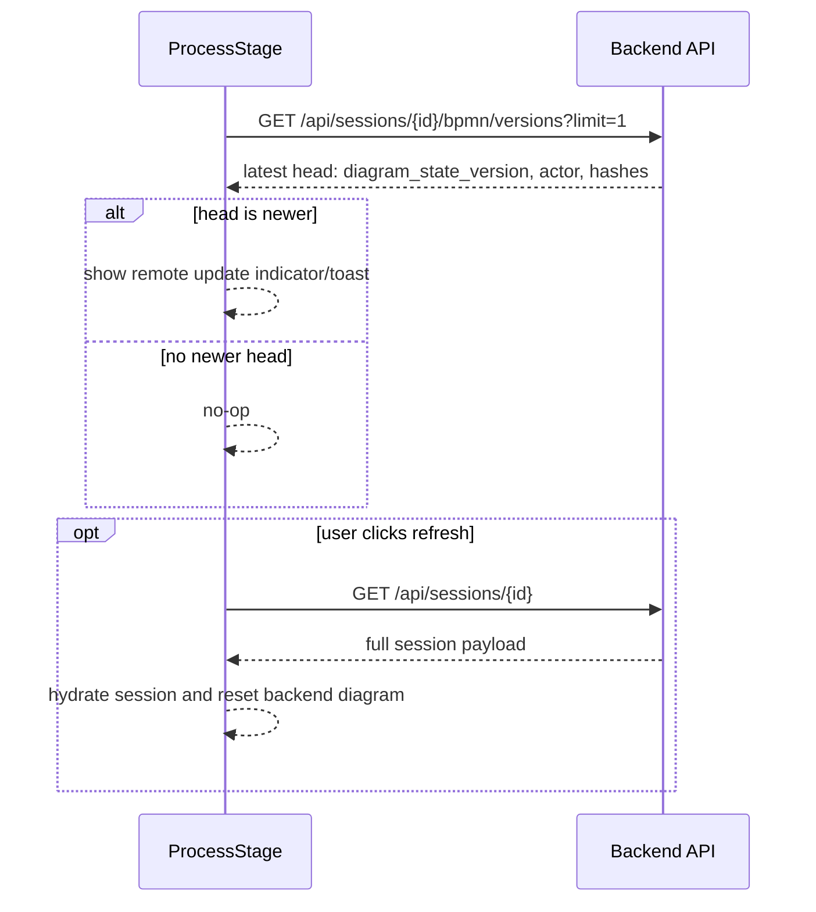

# 08_Карта производительности

## fix/session-remote-poll-head-to-lightweight-summary-v1

> [!summary] Цель
> Фоновый remote poll должен проверять только лёгкий head/summary, не подтягивая полный payload сессии.

| Метрика | До | После | Комментарий |
| ------- | -- | ----- | ----------- |
| Poll interval | 9s | 9s / unchanged | `REMOTE_SESSION_SYNC_POLL_MS = 9000` |
| Head endpoint | `GET /api/sessions/{id}/bpmn/versions?limit=1` | unchanged | Headers-only response, без XML |
| Full session after poll | `GET /api/sessions/{id}` possible after newer head | removed from poll path | Full fetch deferred to explicit refresh action |
| Full session payload | 4.35 MB / 3.41s from audit | only explicit refresh | Background poll no longer auto-fetches multi-MB session |
| Runtime status | baseline from audit | source-tested / stage-pending | Deploy не выполнялся |

> [!success] Source proof
> `frontend/src/components/ProcessStage.jsx::pollRemoteSessionSnapshot` теперь завершает background poll на `apiGetBpmnVersions(sid, { limit: 1 })` и вызывает `applyRemoteSaveHighlightFromVersionHead(...)`. `apiGetSession(sid)` находится в explicit `applyPendingRemoteSaveRefresh`.

