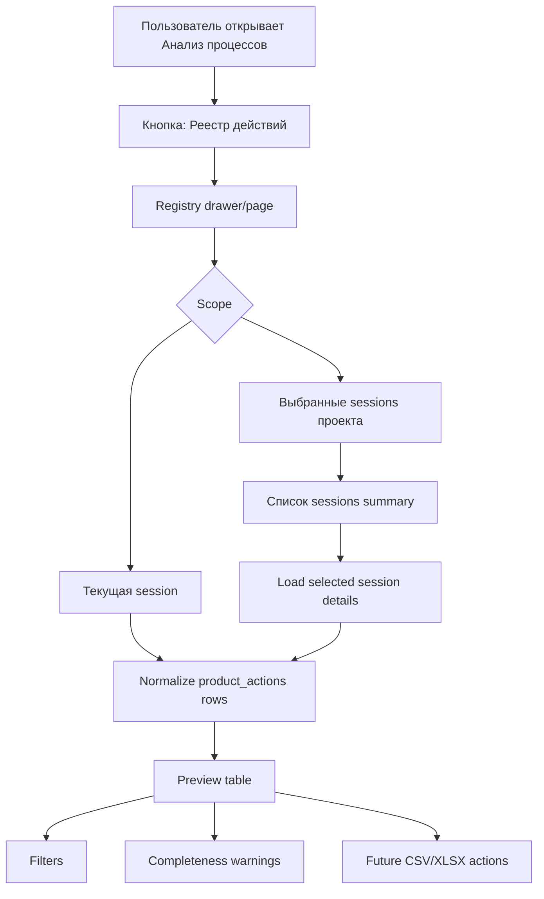

# Product actions registry and export MVP spec v1

Дата: 2026-05-06

Контур: `feature/product-actions-registry-and-export-mvp-spec-v1`

Вердикт: `PRODUCT_ACTIONS_REGISTRY_MVP_SPEC_READY`

## 1. GSD / source truth

| Поле | Значение |
| --- | --- |
| GSD CLI | `GSD_UNAVAILABLE`: `gsd` не найден |
| GSD SDK | `/Users/mac/.nvm/versions/node/v22.19.0/bin/gsd-sdk`, `v0.1.0`; route query unsupported |
| Route | `GSD_FALLBACK_MANUAL_SPEC_AND_SOURCE_MAP` |
| Worktree | `/tmp/processmap_product_actions_registry_spec_v1` |
| Branch | `feature/product-actions-registry-and-export-mvp-spec-v1` |
| HEAD / origin/main / merge-base | `74e6e68bce74a054ab90d55b65d9d8ba8e19e21f` |
| Base | clean worktree from `origin/main` |
| Product code | не менялся |

Ambiguity score after source map:

| Dimension | Score | Gate |
| --- | ---: | --- |
| Goal clarity | 0.88 | pass |
| Boundary clarity | 0.86 | pass |
| Constraint clarity | 0.78 | pass |
| Acceptance criteria | 0.82 | pass |

Weighted ambiguity: `0.17`, gate `<= 0.20`.

## 2. Executive summary

`interview.analysis.product_actions[]` уже доказан как durable MVP source для действий с продуктом. Следующий продуктовый слой не должен быть очередным polish блока B. Нужна отдельная поверхность `Реестр действий с продуктом`, которая собирает строки из одной или нескольких sessions, показывает preview с фильтрами и готовит пользователя к будущей CSV/XLSX выгрузке.

MVP должен идти в две ступени:

1. Frontend-only registry preview для текущей session и опционально выбранных sessions проекта через существующие API.
2. Backend aggregation/export endpoint позже, когда нужен устойчивый multi-session payload, права, пагинация, CSV/XLSX generation и audit.

Не нужно начинать с normalized DB schema или XLSX library в первом implementation contour. Основной риск сейчас: случайно построить export поверх full session loads для 50-500 sessions и повторить heavy payload проблему.

## 3. Source map

| Area | Current source | Evidence | Implication |
| --- | --- | --- | --- |
| Product-action truth | `interview.analysis.product_actions[]` | `ProductActionsPanel.jsx`, `productActionsModel.js`, Atlas runtime proof v2 | Registry reads this namespace; no BPMN XML source |
| Row normalization | `normalizeProductActionsList()`, `normalizeProductActionRow()` | `frontend/src/features/process/analysis/productActionsModel.js` | Reuse for preview and export row model |
| Save path | `saveProductActionForStep()` -> `patchInterviewAnalysis()` -> `PATCH /sessions` | `productActionsPersistence.js`, `interviewAnalysisPatchHelper.js` | Do not change in registry MVP |
| Current session UI | `ProductActionsPanel` has `По выбранному шагу / Все действия` | `ProductActionsPanel.jsx` | This solves in-session visibility, not cross-session registry |
| Analysis placement | Product panel embedded in B-block companion | `InterviewStage.jsx` | Registry should be opened from Analysis but not live inside B-block |
| Workbench tabs | `Анализ процессов`, `Diagram (BPMN)`, `XML`, `DOC`, `DOD` | `processWorkbench.config.js` | Registry can be a sub-surface/action inside Analysis, not necessarily top-level tab yet |
| Explorer project sessions | `apiGetProjectPage()`, `apiListProjectSessions(projectId, view="summary")` | `explorerApi.js`, `api.js`, `backend/tests/test_project_sessions_summary.py` | Project-level registry can select sessions cheaply using summary rows |
| Full session read | `apiGetSession(sessionId)` | `api.js` | Needed today to read `interview.analysis.product_actions[]`; expensive across many sessions |
| Existing export | `/api/sessions/{sid}/export(.zip)` legacy process export | `_legacy_main.py`, `apiGetExport()` | Not product-action CSV/XLSX; do not reuse as-is |
| Heavy payload guard | project session summary excludes `interview`, `bpmn_xml`, `bpmn_meta` | `Storage.list_project_session_summaries()`, test | Backend registry endpoint should avoid full session payloads |
| Permissions | project/session load paths use project/org scope guards | `_legacy_main.list_project_sessions`, `explorer.py`, notes/admin patterns | Aggregation endpoint must enforce project membership/session access |

## 4. Product problem

Бизнесу нужен список физических действий сотрудника с продуктом, ингредиентом, полуфабрикатом, готовым блюдом, тарой или упаковкой по нескольким BPMN-процессам и группам товаров.

Текущая панель B отвечает на вопрос: "что заведено по выбранному шагу этой session". Реестр должен отвечать на другой вопрос: "какие действия с продуктом заведены по выбранным процессам/товарам и готовы ли они к выгрузке".

## 5. UX entry points

| Entry | MVP role | Decision |
| --- | --- | --- |
| `Анализ процессов` / B-block | Contextual entry from current session | Primary MVP entry: button/link `Открыть реестр действий` near `Действия с продуктом` or Analysis header |
| Project / Explorer project page | Cross-session entry | Secondary MVP entry: project action `Реестр действий с продуктом` near sessions list |
| Future main menu | Portfolio/org-level analytics | Later: after backend aggregation and permissions model |

MVP should not make registry a top-level workbench tab yet. A tab would imply this is equal to Diagram/XML/DOC/DOD, while the first version is an analysis sub-surface.

## 6. UX flow



## 7. Registry row fields

### Required MVP columns

| Column | Source | Required | Notes |
| --- | --- | --- | --- |
| `project_id` | session/project context | yes | Needed for multi-process export |
| `project_title` | project/explorer context | recommended | May be absent in frontend-only current session |
| `session_id` | session context or row.session_id | yes | Stable process/session source |
| `session_title` | session title | yes | User-facing process name |
| `product_group` | row.product_group | yes for complete row | Main grouping for business |
| `product_name` | row.product_name | yes for complete row | Product filter/export field |
| `action_type` | row.action_type | yes for complete row | Taxonomy currently local constants/custom text |
| `action_stage` | row.action_stage | recommended | Differentiates same action in process |
| `action_object` | row.action_object | yes for complete row | Product/ingredient/container object |
| `action_object_category` | row.action_object_category | recommended | Product/ingredient/package/etc |
| `action_method` | row.action_method | recommended | Differentiates same type/stage |
| `role` | row.role | recommended | Performer |
| `step_label` | row.step_label | yes | Human-readable process step |
| `step_id` | row.step_id | yes when available | Interview binding |
| `bpmn_element_id` | row.bpmn_element_id / row.node_id | yes when available | BPMN binding |
| `work_duration_sec` | row.work_duration_sec | optional | Timing hint |
| `wait_duration_sec` | row.wait_duration_sec | optional | Timing hint |
| `source` | row.source | yes | `manual` for MVP |
| `updated_at` | row.updated_at | recommended | Helps audit freshness |
| `completeness` | derived | yes | `complete` / `incomplete` |

### CSV/XLSX column order

1. `project_title`
2. `project_id`
3. `session_title`
4. `session_id`
5. `product_group`
6. `product_name`
7. `action_type`
8. `action_stage`
9. `action_object_category`
10. `action_object`
11. `action_method`
12. `role`
13. `step_label`
14. `step_id`
15. `bpmn_element_id`
16. `work_duration_sec`
17. `wait_duration_sec`
18. `source`
19. `updated_at`
20. `completeness`

## 8. Filters

| Filter | MVP | Later |
| --- | --- | --- |
| Project | fixed by entry context | org/workspace-wide selector |
| Sessions / BPMN processes | multi-select project sessions | saved process sets |
| Product group | text/multi-select from loaded rows | dictionary-backed |
| Product | text/multi-select from loaded rows | dictionary-backed |
| Action type | multi-select from loaded rows/constants | taxonomy admin |
| Stage | multi-select from loaded rows/constants | taxonomy admin |
| Object category | multi-select | taxonomy admin |
| Role | multi-select | org roles |
| Completeness | all / complete / incomplete | validation profile |
| Source | manual/suggested/import | after extraction/import exists |

## 9. Preview behavior

Preview is the main MVP deliverable. It must show:

- total selected sessions;
- total product action rows;
- complete vs incomplete rows;
- empty state if no actions found;
- table/cards with row context;
- row-level warnings for missing product/action/object/binding;
- link/CTA to open source session and selected step when possible;
- disabled export buttons with copy: `CSV/XLSX будет доступен после backend/export контура` if export is not implemented yet.

Default sorting:

1. `product_group`
2. `product_name`
3. `session_title`
4. `step_label`
5. `action_stage`
6. `action_type`

## 10. Frontend-only MVP

### In scope

- New registry sub-surface/drawer opened from `Анализ процессов`.
- Current session preview using already loaded `interview.analysis.product_actions[]`.
- Project-level session picker using existing `apiListProjectSessions(projectId, view="summary")`.
- Loading selected sessions with existing `apiGetSession()` for small bounded selections.
- Normalization using `normalizeProductActionsList()`.
- Filters and preview table.
- Completeness computation.
- UI-only export placeholders or CSV preview copy if export is deferred.

### Boundaries

Frontend-only MVP must cap selected sessions, for example `<= 20`, unless backend aggregation exists. It should show warning when the user selects too many sessions.

It must not:

- write product actions;
- change `ProductActionsPanel -> patchInterviewAnalysis`;
- change BPMN XML;
- create backend schema;
- create taxonomy admin;
- introduce AI extraction;
- silently load every session in a large project.

## 11. Backend aggregation endpoint later

Recommended endpoint:

```text
POST /api/projects/{project_id}/analysis/product-actions/registry
```

Request:

```json
{
  "session_ids": ["sid_1", "sid_2"],
  "filters": {
    "product_groups": [],
    "products": [],
    "action_types": [],
    "stages": [],
    "roles": [],
    "completeness": "all"
  },
  "limit": 1000,
  "offset": 0
}
```

Response:

```json
{
  "project_id": "pid",
  "rows": [],
  "summary": {
    "sessions_selected": 2,
    "actions_total": 42,
    "complete": 37,
    "incomplete": 5
  },
  "page": { "limit": 1000, "offset": 0, "total": 42 }
}
```

Backend requirements:

- enforce org/project/session permissions;
- read only `interview_json` and minimal session metadata, not BPMN XML;
- never mutate sessions;
- return paginated rows;
- include `session_title`, `project_title`, `diagram_state_version`, `updated_at`;
- cap request sizes;
- support future CSV/XLSX export using the same query model.

## 12. CSV/XLSX roadmap

| Step | Contour | Output | Notes |
| --- | --- | --- | --- |
| 1 | `feature/product-actions-registry-surface-v1` | preview only | frontend-only bounded |
| 2 | `feature/product-actions-registry-project-aggregation-api-v1` | backend JSON endpoint | avoids N full session loads |
| 3 | `feature/product-actions-export-csv-v1` | CSV download | can be backend or client-generated from registry rows |
| 4 | `feature/product-actions-export-xlsx-v1` | XLSX workbook | backend preferred for stable formatting and large data |
| 5 | `feature/product-action-taxonomy-dictionaries-v1` | dictionaries/admin | improves filter quality |

CSV can be frontend-generated for small current-session preview. XLSX should be backend or an explicitly approved frontend dependency contour, because bundle size and formatting requirements matter.

## 13. Performance and payload risks

| Risk | Why it matters | Mitigation |
| --- | --- | --- |
| N full session loads | `apiGetSession()` returns heavy session payload | frontend-only MVP caps selections; backend endpoint later reads minimal fields |
| Large `interview_json` | reports/path outputs may live inside Interview | backend aggregation extracts only `analysis.product_actions` |
| Project with 500 sessions | summary view is cheap, detail loads are not | use `view=summary`, paging, selected-only loading |
| CSV/XLSX memory | large table generation can freeze browser | backend streaming/file response for large exports |
| Permissions leakage | project/session access is scoped by org/project membership | backend aggregation must enforce the same guards as session/project APIs |
| Stale data | registry preview may load old session detail while user edits | show `updated_at` and refresh action; no silent autosave |

## 14. Acceptance criteria

### Product spec acceptance

- [ ] Spec identifies entry points from Analysis, Project/Explorer, and future menu.
- [ ] Spec defines current-session and project multi-session data collection.
- [ ] Spec defines row fields and CSV/XLSX column order.
- [ ] Spec defines filters and preview behavior.
- [ ] Spec separates frontend-only MVP from backend aggregation/export.
- [ ] Spec lists payload/performance/permissions risks.
- [ ] Spec does not change save path, BPMN XML truth, backend/schema, taxonomy, AI extraction.

### Frontend MVP acceptance

- [ ] From `Анализ процессов`, user can open `Реестр действий с продуктом`.
- [ ] Current session rows are shown from `interview.analysis.product_actions[]`.
- [ ] User can switch to project/session selection.
- [ ] Project sessions list uses summary API, not full session payload.
- [ ] Selected sessions are capped or explicitly warned before full session loads.
- [ ] Preview shows all loaded action rows with project/session/step/BPMN context.
- [ ] Filters work for product group, product, action type, stage, object category, role, completeness.
- [ ] Incomplete rows are visible and marked.
- [ ] Export buttons are either absent, disabled with clear copy, or CSV-only if explicitly approved in implementation contour.

### Backend aggregation acceptance later

- [ ] Endpoint returns rows without BPMN XML.
- [ ] Endpoint enforces org/project/session permissions.
- [ ] Endpoint paginates and caps results.
- [ ] Endpoint returns summary counts.
- [ ] Endpoint supports the same filters as frontend preview.
- [ ] Endpoint does not mutate session state.

## 15. Recommended decomposition

| Priority | Contour | Goal | Validation |
| --- | --- | --- | --- |
| P0 | `feature/product-actions-registry-surface-v1` | Registry drawer/page for current session + selected project sessions preview | frontend tests + local/stage read-only proof |
| P1 | `feature/product-actions-registry-filters-v1` | robust filter model and URL/local state | model tests + UI proof |
| P1 | `feature/product-actions-registry-project-aggregation-api-v1` | backend read-only aggregation endpoint | backend permission/payload tests |
| P2 | `feature/product-actions-export-csv-v1` | CSV download from registry rows | CSV golden tests + Excel open smoke |
| P2 | `feature/product-actions-export-xlsx-v1` | XLSX workbook | library decision + file content tests |
| P2 | `feature/product-action-taxonomy-dictionaries-v1` | managed dictionaries | separate admin/product decision |

## 16. Next implementation contour

Recommended next prompt:

```text
feature/product-actions-registry-surface-v1

Build a frontend-only product actions registry preview surface.
Scope:
- open from Анализ процессов;
- current session preview from interview.analysis.product_actions[];
- project session selector using apiListProjectSessions(view=summary);
- selected session detail loading capped at 20 sessions via apiGetSession;
- normalize rows with productActionsModel;
- filters: product group/product/action type/stage/object category/role/completeness;
- preview table with project/session/step/BPMN context;
- export buttons disabled or omitted;
- no backend/schema/BPMN XML/save path changes.
```

## 17. Plan-gate decision

> [!summary]
> `feature/product-actions-registry-and-export-mvp-spec-v1` is a product/design + source-map contour. It approves a bounded next MVP for registry preview, but does not approve CSV/XLSX implementation, backend aggregation, schema changes, taxonomy dictionaries, or AI extraction in this contour.

| Decision | Verdict | Rationale |
| --- | --- | --- |
| Separate registry from B-block | approved | B-block remains data capture for one session/selected step; registry is aggregate review/export prep |
| Use `interview.analysis.product_actions[]` | approved | runtime proof already validated persistence/reload/no BPMN XML pollution |
| Frontend-only current-session preview | approved for next contour | reads already loaded data and does not touch save path |
| Project selected-sessions preview | approved only with cap/warning | existing summary API is cheap, but full session detail loads are expensive |
| CSV export | not approved in this contour | needs explicit implementation contour and row-count/file-format validation |
| XLSX export | not approved in this contour | needs dependency/backend decision and file-content tests |
| Backend aggregation | not approved in this contour | needs separate endpoint design, permission tests, pagination, payload tests |
| Schema/taxonomy | not approved | dictionaries and normalized model are later product decisions |

Implementation gate for the next contour:

1. Start with `feature/product-actions-registry-surface-v1`.
2. Build preview first, not export.
3. Keep current save path unchanged.
4. Keep BPMN XML untouched.
5. Use project session summaries for selection and full session reads only for selected/capped sessions.
6. Show export as disabled/future unless a separate export contour explicitly approves it.

Final verdict: `PRODUCT_ACTIONS_REGISTRY_MVP_SPEC_READY`
